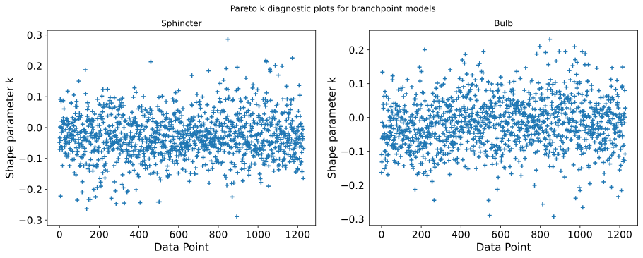
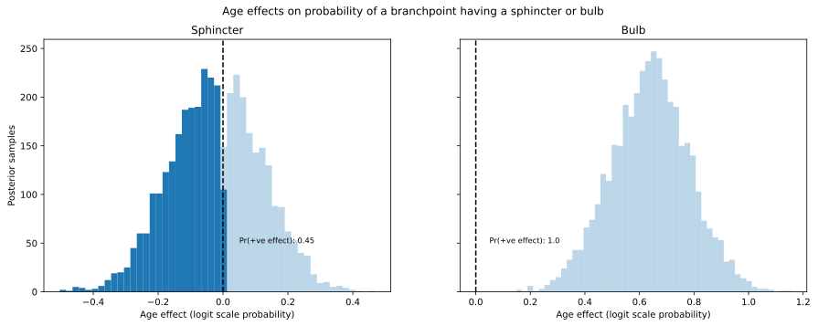

# Details of the branchpoint analysis {#sec-branchpoint-details}

The branchpoint data consisted classifications branchpoints as having or not having a sphincter and/or a bulb, as well the following predictive features: branch number, depth and ratio of first order capillaries to penetrating arterioles.

## Software

Similarly to the collaterals analysis, we defined statistical models using pymc [@abril-pla_pymc_2023] via bambi [@capretto_bambi_2022].

All code relating to this analysis can be found at <https://github.com/teddygroves/sphincter/blob/main/sphincter/branchpoints.py>.

## Data processing

We discarded measurements for which the measured depth was zero, or where any dependent or explanatory variables were unmeasured.

The resulting table can be inspected at <https://github.com/teddygroves/sphincter/blob/main/data/prepared/branchpoints.csv>.

## Statistical model

We used a logistic regression model to predict sphincter or bulb occurrence for each branchpoint in our dataset, with effects for age, branch number, log-scale depth and logit-scale first-order-to-penetrating-arteriole ratio.

In bambi's formula language our model was written as `"{y}['True'] ~ age + branch_number + ln_depth + logit_firstorder_per_pa"`, where `"{y}"` can be sustituted with the name of a boolean variable representing whether or not a branchpoint has a bulb or sphincter.

The priors were the bambi defaults, which aim to be weakly informative while automatically scaling to match the predictors.

## Results

We assessed model specification by estimating leave-one-out predictive probabilities and examining the distribution of pointwise pareto-k parameters. The results were acceptable in both cases, indicating clearly better-than-random prediction in both cases: on average our models probabilities 0.552 and 0.573 to the correct classifications. The figure below shows the distribution of pareto k parameters for the estimation method we used, indicating that our estimated leave-one-out probabilities were accurate. See [@psis] for more about this method.

The figure below shows the distribution of estimated age effects. There is a clear tendency for branchpoints in old mice to have more frequent bulbs, and no effect of age on whether a branchpoint has a sphincter.

