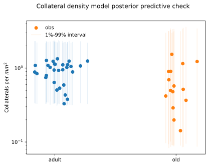
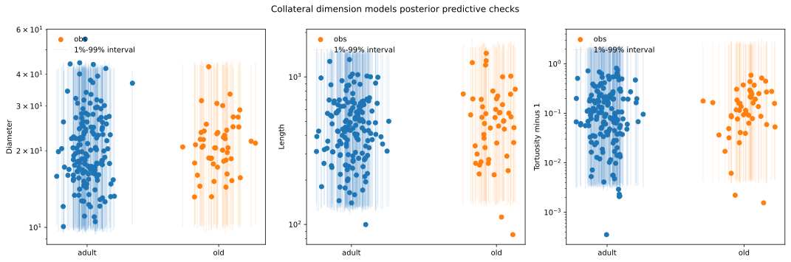
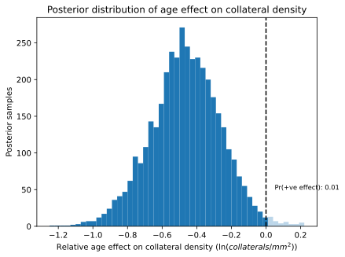
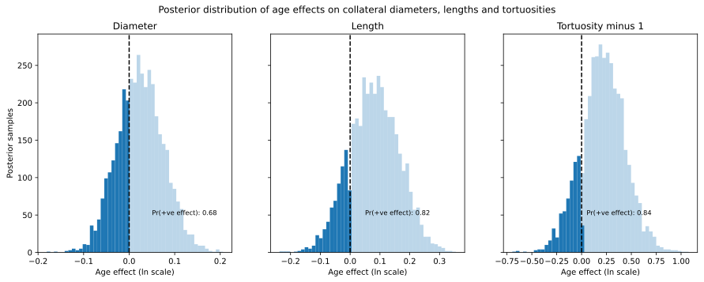

# Details of the collaterals analysis {#sec-collaterals-details}

The collaterals data consisted of measurements of collateral diameter, length and tortuosity, as well as counts recording the number of collaterals per brain surface area. All of these measurements came with mouse ids, and all mice were labelled as adult or old.

## Software

Since this data did not involve a nested structure of categorical features, we used the simpler formula-based model specification framework bambi [@capretto_bambi_2022], avoiding the need to hand-write Stan programmes.

All code relating to this analysis can be found at <https://github.com/teddygroves/sphincter/blob/main/sphincter/collaterals.py>.

## Data processing

We created two tables: one recording the diameter, length and tortuosity of each measured collateral and one with the measured collateral density per mouse.

We discarded measurements for which the measured tortuosity was not greater than one, or where any of the diameter, length or tortuosity were not measured.

The resulting tables can be inspected at <https://github.com/teddygroves/sphincter/blob/main/data/prepared/collaterals.csv> and <https://github.com/teddygroves/sphincter/blob/main/data/prepared/collaterals-mice.csv>.

## Statistical model

We used a linear regression model on natural logarithmic scale to model all collateral measurements, with effects for age. In bambi's formula language our model was written as `"{y} ~ age"`, where `"{y}"` can be sustituted with the name of a dependent variable representing log-scale collateral density, diameter, length or tortuosity minus the theoretical minimum value 1.

The priors were the bambi defaults, which aim to be weakly informative while automatically scaling to match the predictors.

## Results

The following figure show the fits of our models' posterior predictive distributions to the observed data: the fit is acceptable in all cases.

These figures show the distribution of estimated effects. There is a clear tendency for old mice to have lower collateral density, and no clear age effect on any of the collateral dimensions. 

