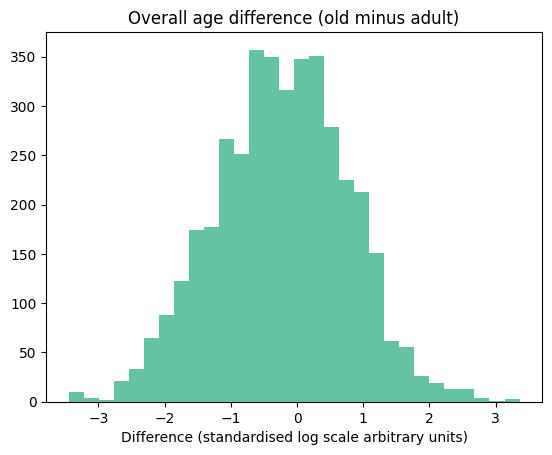

# Details of the density analysis

The density dataset consisted of 144 measurements from five adult and four old
mice.

## Dependent variable

The dependent variable in this case was vessel density, measured as in
length of vessel per unit of volume. These measurements are shown in figure
@fig-density-measurements on both natural and logarithmic scales.

:::{#fig-density-measurements}

Vessel density measurements

:::

We noticed several interesting patterns in this data. 

First, there is a clear trend for vessel density to increase with vessel order
until the cap6 vessel type and then to decrease, with adjacent vessel types
tending to have similar densities. 

Second, the vessel types `pa` and `av` somewhat buck this trend, with a similar
upward deviation in both cases. These vessel types---i.e. penetrating arterioles
and ascending venules---have the common characterstic of being vertically
oriented.

Finally, we noticed that the measurements are somewhat more dispersed for
higher-order capillaries, especially on log scale.

## Statistical model

We modelled the measurement process using a linear model on logarithmic scale.
In this model, given measurement $y$, linear predictor $\hat{y}$ and measurement
error parameter $\sigma$, the measurement probability density is given by this
equation:

\begin{equation}
  p(y\mid\hat{y}, \sigma) = Normal(\ln{y}\mid hat{y}, \sigma) \label{eq:measurement-model-density}
\end{equation}

We modelled the linear predictor $\hat{y}$ as depending on an age-specific mean
$\mu$, an age and vessel type specific parameter $\alpha^{age,vessel type}$ and
a scalar $\alpha^{vert}$:

\begin{align}
  \hat{y} &= \mu_a \label{eq:density-measurement-model} \\
          &+ \alpha^{age:vesseltype}_{av} \nonumber \\ 
          &+ vert(v) \cdot \alpha^{vert} \nonumber
\end{align}

where $vert(v)$ is an indicator function with value 1 if v represents a vertical
vessel and zero otherwise.

In order to capture the observed smoothness between adjacent vessel types,
we used Gaussian random walk priors for the $\alpha^{age:vesseltype}$
parameters for adult mice, and on the differences at each vessel type between
adult and old mice:

\begin{align}
  \alpha^{age:vesseltype}_{1v} &\sim N(\alpha^{age:vesseltype}_{1v-1}, \lambda_1)\label{eq:smooth} \\
  \delta_v &= \alpha^{age:vesseltype}_{2v} - \alpha^{age:vesseltype}_{1v} \nonumber \\
         &\sim N(\delta_{v-1}, \lambda_2) \nonumber
\end{align}

This approach to smoothing parameters corresponding to ordered categories is
essentially the same as that used in @gaoImprovingMultilevelRegression2019 to
model age effects on voting behaviour. As explained in that paper, the random
walk priors allow for information sharing between categories, without the need
for detailed assumptions about the functional form of the overall relationship.

The other priors in our model were as follows (units are on standardised
logarithmic scale):

\begin{align}
  \alpha^{vert} &\sim N(0, 0.1) \label{eq:density-other-priors} \\
  \mu &\sim N(0, 1) \nonumber \\
  \lambda_1 &\sim N(0, 0.3) \nonumber \\
  \lambda_2 &\sim N(0, 0.1) \nonumber \\
  \sigma &\sim N(0, 1) \nonumber \\
\end{align}

## Results

@fig-density-ppc shows the overall fit of our model to the observed data. We
judged that the overall fit to the observed measurements was adequate and did
not attempt model evaluation using estimated leave-one-out density as given the
highly correlated data it would be difficult to perform the necessary estimates
with acceptable accuracy.

The one aspect of the data that our model does not adequately capture is the
increased dispersion in the measurements of high order capillaries. We expect
that this could be accounted for by adding a distributional component to our
model, but we judged that this would be unlikely to dramatically change our
results.

:::{#fig-density-ppc}

Posterior predictive check for our final vessel density model, shown on natural
and logarithmic scale.

:::

@fig-density-effects-detail shows posterior 94% credible intervals for the
quantity $(\mu_2 + \alpha^{age:vessel type}_2) - (\mu_2 + \alpha^{age:vessel
type}_2)$ for each vessel type; in other words, the overall difference, on
standardised log scale, in densities between old and adult mice for each vessel
type.

:::{#fig-density-effects-detail}

Main result of our density analysis: old and adult mice have different vessel
density patterns.

:::

There is a clear trend, with three low order capillary types separated from zero
on the left and five high order types separated on the right.

Finally, @fig-density-mu shows that, according to our model, there is no
particular effect of age on overall vessel density.

:::{#fig-density-mu}

Histogram of posterior samples for overall age effects on density (old minus
adult). The probability mass does not concentrate away from zero, indicating no
clear overall age effect.

:::
