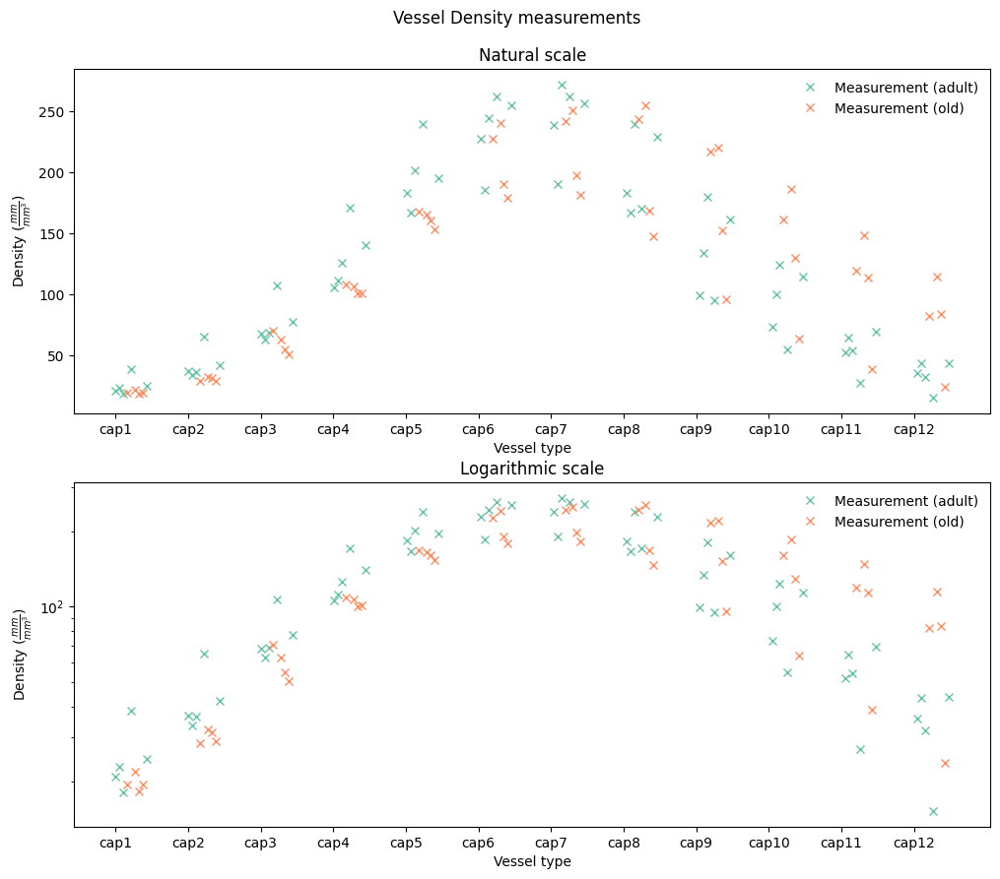
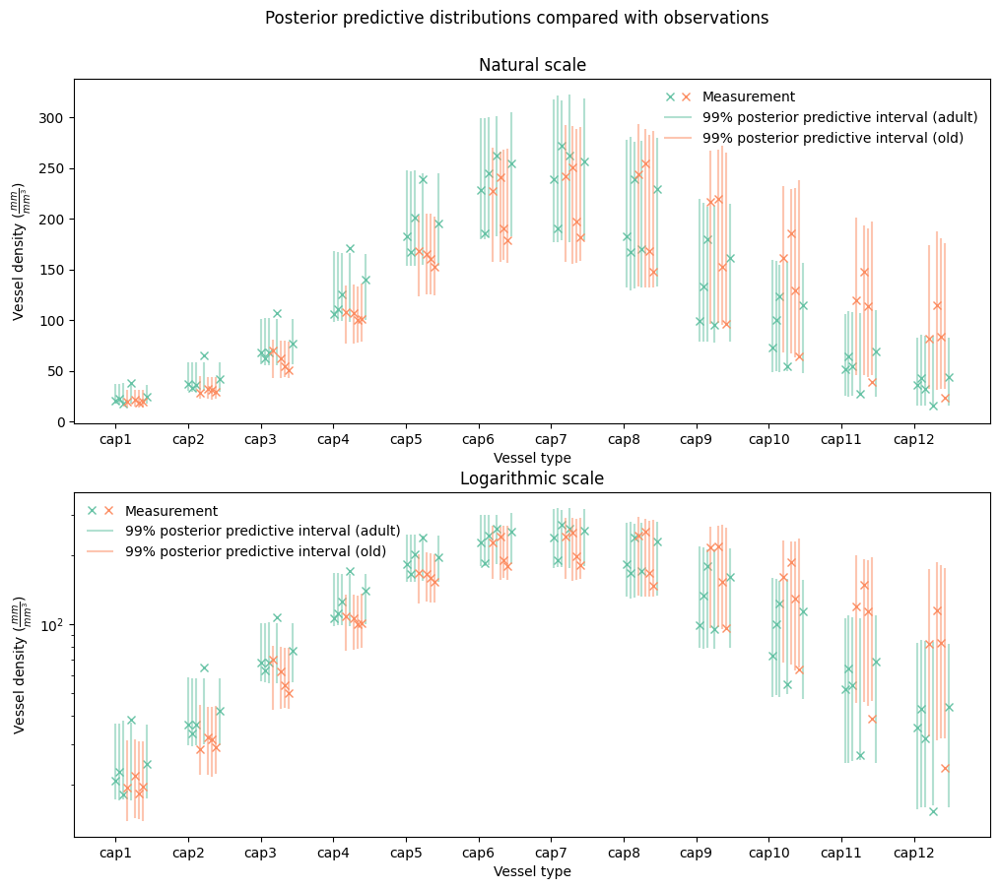
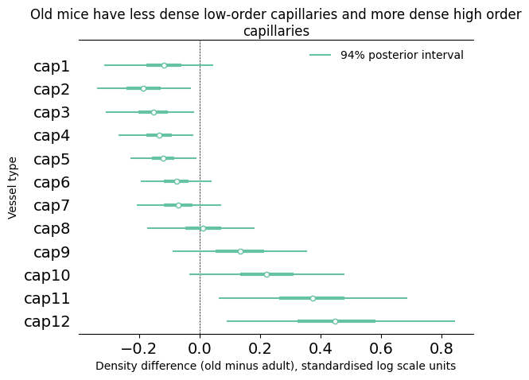

# Details of the density analysis {#sec-density-details}

The density dataset consisted of 144 measurements from five adult and four old
mice.

## Dependent variable

The dependent variable in this case was capillary density, measured as
in length of vessel per unit of volume. These measurements are shown in
@fig-density-measurements on both natural and logarithmic scales.

:::{#fig-density-measurements}

Vessel density measurements

:::

We noticed several interesting patterns in this data. 

First, there is a clear trend for capillary density to increase with vessel
order until the cap6 vessel type and then to decrease, with adjacent vessel
types tending to have similar densities.

Second, we noticed that the measurements are somewhat more dispersed for
higher-order capillaries, with the level of dispersion increasing somewhat
smoothly.

## Statistical model {#sec-density-model}

We modelled the measurement process using a linear model on logarithmic
scale. In this model, given measurement $y$, linear predictor $\hat{y}$ and
a vessel type specific measurement error parameter $\sigma$, the measurement
probability density is given by this equation:

\begin{equation}
  p(y\mid\alpha, \sigma) = Normal(\ln{y}\mid \alpha, \sigma) \label{eq:measurement-model-density}
\end{equation}

In order to capture the observed smoothness between adjacent vessel types,
we used Gaussian random walk priors for the $\alpha^{age:vesseltype}$
parameters:

\begin{align}
  \alpha_{a,v} &\sim N(\alpha_{a,v-1}, \lambda^{\alpha}_a)\label{eq:smooth} \\
\end{align}

We also used a Gaussian random walk prior on log standardised scale for the
measurement error parameter $\sigma$, where $\sigma^{std}=\frac{\sigma}{sd(\ln
y)}$:

\begin{align}
  \ln\sigma^{std}_{v} &\sim N(\ln\sigma^{std}_{v-1}, \lambda^s)\label{eq:smooth-sigma} \\
\end{align}

This approach to smoothing parameters corresponding to ordered categories is
essentially the same as that used in @gaoImprovingMultilevelRegression2019 to
model age effects on voting behaviour. As explained in that paper, the random
walk priors allow for information sharing between categories, without the need
for detailed assumptions about the functional form of the overall relationship.

The other priors in our model were as follows (units are on standardised
logarithmic scale):

\begin{align}
  \alpha_{1} &\sim N(0, 0.1) \label{eq:density-other-priors} \\
  \ln\sigma^{std}_{1} &\sim N(-1.5, 1) \nonumber \\
  \lambda^{\alpha} &\sim N(0, 0.3) \nonumber \\
  \lambda^{\sigma} &\sim N(0, 0.3) \nonumber \\
\end{align}

## Results

@fig-density-ppc shows the overall fit of our model to the observed data. We
judged that the overall fit to the observed measurements was adequate and did
not attempt model evaluation using estimated leave-one-out density as given the
highly correlated data it would be difficult to perform the necessary estimates
with acceptable accuracy. In particular, our model captured the increase and
decrease in density with increasing capillary order for both age categories, and
the higher dispersion at higher capillary orders.

:::{#fig-density-ppc}

Posterior predictive check for our final vessel density model, shown on natural
and logarithmic scale.

:::

@fig-density-effects-detail shows posterior 94% credible intervals for the
quantity $\alpha_{2} - \alpha_{1}$ for each vessel type; in other words, the
overall difference, on standardised log scale, in densities between old and
adult mice for each vessel type.

:::{#fig-density-effects-detail}

Main result of our density analysis: old and adult mice have different vessel
density patterns.

:::

There is a clear trend, with four low order capillary types separated from zero
on the left and two high order types separated on the right.

