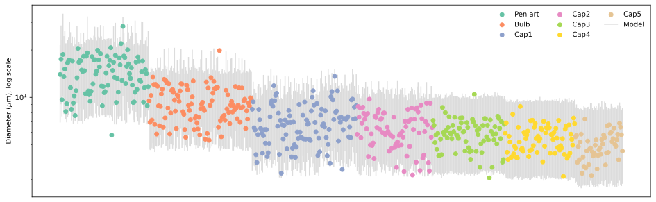
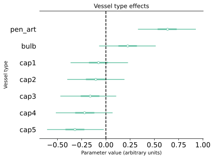
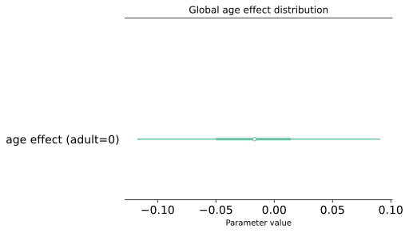
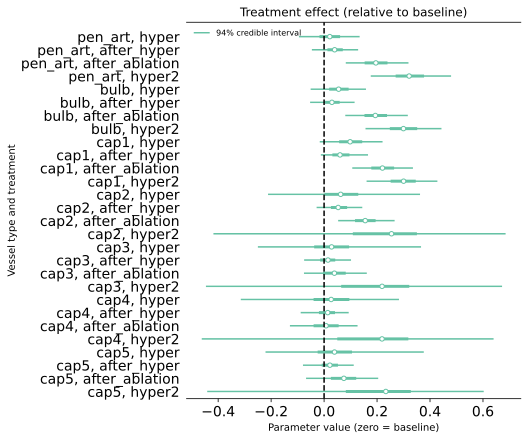

# Details of the diameter analysis {#sec-diameter-details}

## Data

For the diameter analysis we used the same dataset and processing as for the pulsatility analysis.

## Statistical model

We used a lognormal generalised linear model implemented in Stan: see the file [`sphincter/stan/diameter.stan`](https://github.com/teddygroves/sphincter/blob/main/sphincter/stan/diameter.stan). Our model's linear predictor $\eta_{avt}$ for a vessel with age $a$, vessel type $v$ and treatment $t$ is determined by the following sum:

\begin{align}
\eta_{avt} &= \mu_a \\
           &+ \alpha^{treatment}_t \\
           &+ \alpha^{vessel\ type}_v \\
           &+ \alpha^{vessel\ type:treatment}_{vt} \\
           &+ \alpha^{age:vessel\ type}_{av}
\end{align}

Our model's likelihood for a measurement $y_{avt}$ is given by

$$
y_{avt} \sim LN(\eta_{avt}, \sigma)
$$ {#eq-diameter-likelihood}

where $\sigma$ is a scalar parameter.

The prior model is as follows:

\begin{align}
  \sigma &\sim N(0, 0.5) \\
  \mu &\sim N(2, 0.5) \\
  \alpha^{treatment} &\sim N(0, \tau^{treatment}) \\
  \alpha^{vessel\ type}_v &\sim N(0, \tau^{vessel\ type}) \\
  \alpha^{vessel\ type:treatment}_{vt} &\sim N(0, \tau^{vessel\ type:treatment}) \\
  \alpha^{age:vessel\ type}_{av} &\sim N(0, \tau^{age:vessel\ type}) \\
  tau^{vessel\ type} &\sim N(0, 0.5) \\
  tau^{treatment} &\sim N(0, 0.5) \\
  tau^{age:vessel\ type} &\sim N(0, 0.5) \\
  tau^{vessel\ type:treatment} &\sim N(0, 0.5)
\end{align}

## Results

@fig-diameter-ppc shows the measurements with our model's marginal posterior predictive distributions. The fit to the observed data is overall adequate.

::: {#fig-diameter-ppc}

Grey bars represent our model's 1% to 99% posterior predictive interval for each measurement.

:::

@fig-diameter-vessel-type-effects shows the marginal distributions of vessel type effects in our model, i.e. the parameters $\alpha^{vessel\ type}$. As expected, these show declining diameter moving further down the tree of vessels. 

::: {#fig-diameter-vessel-type-effects}

94% posterior intervals for vessel type effects in our diameter model.
:::

@fig-diameter-age-effect-global shows the marginal distributions of our model's global age effect, i.e. the quantity $\mu_{old}-\mu_{adult}$. This plot shows that our model found no global difference between the diameters of adult and old mice.

::: {#fig-diameter-age-effect-global}

94% posterior interval for the global age effect in our diameter model.
:::

@fig-diameter-treatment shows the marginal distributions of our model's treatment effects, i.e. the quantity $\alpha^{treatment}_{t}-\alpha^{treatment}_{baseline} + \alpha^{vessel\ type:treatment}_{vt}-\alpha^{vessel\ type:treatment}_{v,baseline}$ for each vessel type $v$ and non-baseline treatment $t$. Our results show that the ablation and hyper2 treatments were associated with larger diameters in the upper blood vessels.

::: {#fig-diameter-treatment}

94% posterior intervals for treatment effects in our diameter model.
:::
