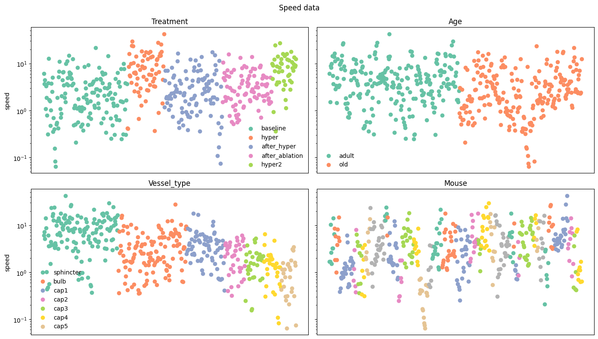
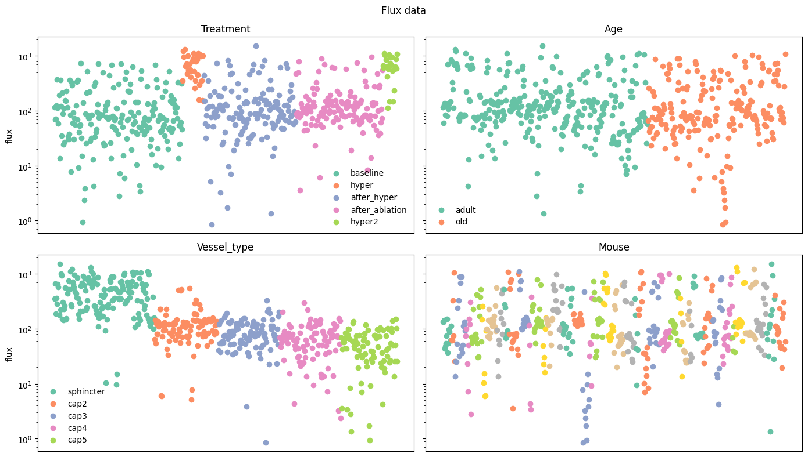
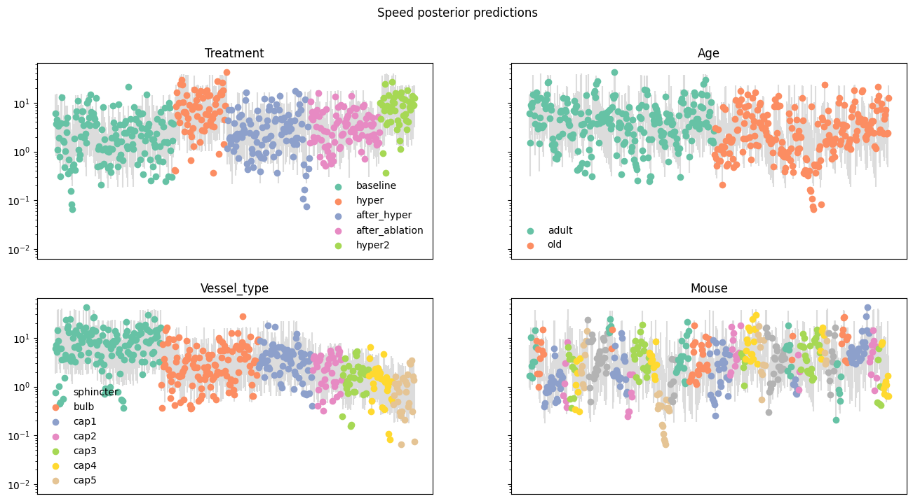
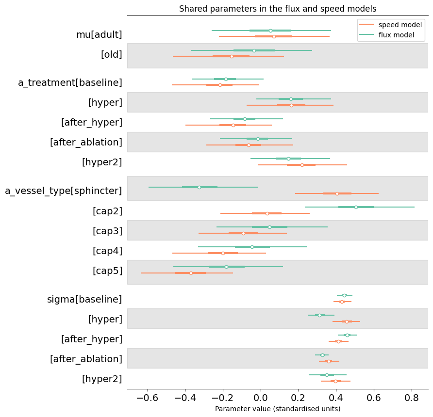
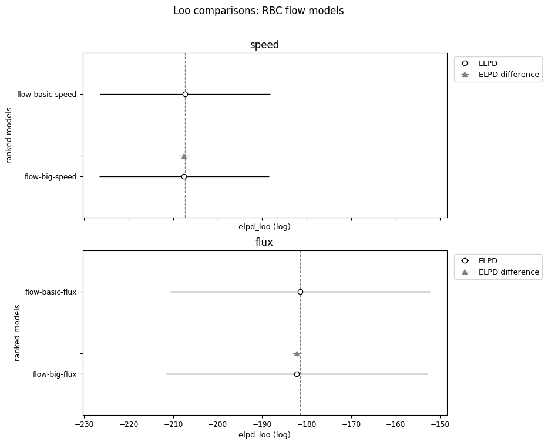
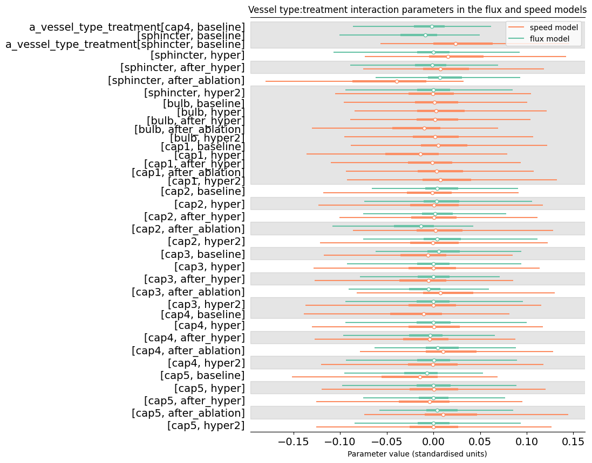

# Details of the red blood cell flow analysis

Our measurements included flow data recording the measured speed and flux of red
blood cells through some vessels. This data is interesting because it allows for
inference of the local blood pressure, which determines the speed. 

We were interested in whether the speed and flux tended to be different between
old and adult mice for a given vessel type and treatment, as this would indicate
that the pressure would likely be similar as well.

## Data processing

There is a significant missing data issue in this case: both speed and flux
measurements were available for only 271 out of 1525 raw measurements. We
therefore conducted separate analyses for speed and flux even though we
suspected that these two quantities are related.

## Dependent variable

We modelled speed and flux measurements on natural logarithmic scale as we
expected multiplicative effects and this transformation ensures support on the
whole real number line, simplifying modelling.

The resulting measurements are shown in figure @fig-flow-data.

:::{#fig-flow-data nrow=2}

Red blood cell speed and flux data

:::

From a glance at these graphs it is clear that there were treatment effects
on both measurement types, particularly from the hypertension treatments, that
there are treatment-related distributional effects, and that both speed and flux
reduce as vessel order increases.

### Statistical models

As in the whisker case we investigated the results of fitting models with
and without interaction effects. Again we found no large or fully resolved
interactions and therefore used the smaller model for further analysis.

Our final model had this specification:

\begin{align}
\ln(y_{vtm}) &\sim N(\hat{y}_{vtm}, \sigma_t) \label{eq-flow-model} \\
\hat{y}_{vtm} &= \mu_a \nonumber \\
  &+ \alpha^{treatment}_{t} \nonumber \\
  &+ \alpha^{vesseltype}_{v} \nonumber \\
\alpha^{treatment}_t &\sim N(0, \tau^{treatment}) \nonumber \\
\alpha^{vesseltype}_v &\sim N(0, \tau^{vesseltype}) \nonumber \\
\sigma_t &\sim HN(0, 0.5) \nonumber \\
\mu &\sim N(0, 0.5) \nonumber \\
\tau^{treatment} &\sim HN(0, 0.5) \nonumber \\
\tau^{vesseltype} &\sim HN(0, 0.5) \nonumber
\end{align}

We chose the prior standard deviation 0.5 after prior predictive checking to
ensure reasonably tight coverage of the observed data.

For investigation of interaction effects we fit another model that extended our
final model with a vessel type:treatment interaction effect as follows:

\begin{align}
\hat{y}_{vtm} &= \mu_a \nonumber \\
  &+ \alpha^{treatment}_{t} \nonumber \\
  &+ \alpha^{vesseltype}_{v} \nonumber \\
  &+ \alpha^{vesseltype:treatment}_{vt} \nonumber \\
\alpha^{vesseltype:treatment}_v &\sim N(0, \tau^{vesseltype:treatment}) \nonumber \\
\tau^{vesseltype:treatment} &\sim HN(0, 0.5) \nonumber
\end{align}

## Results

Our statistical model successfully captured all of these trends, as can be seen
from figure @fig-flow-ppc

:::{#fig-flow-ppc nrow=2}

Posterior predictive checks for flow models
:::

### Shared parameters

@fig-flow-shared summarises the marginal posterior distributions for parameters
that appear in both our final flux and speed models. There is quite a lot of
agreement, unsurprisingly given that red blood cell speed and flux are closely
related. We conclude from this plot that, given sufficient data, a joint model
including both measurement types would be a good topic for future analysis.

It is also interesting to note the main area where our flux and speed models
disagree, namely the effect corresponding the vessel type sphincter. According
to our model, the sphincter tends to have the lowest RBC speed of all vessels
but the highest flux.

:::{#fig-flow-shared}

Posterior distributions of parameters that appear in both our flow and speed
models. 

:::

### Interactions

To test for important interaction effects we fit a model with vessel
type:treatment interaction parameters. This model achieved marginally worse
loo elpd scores as shown in figure @fig-flow-loo. 

:::{#fig-flow-loo}

Out of sample predictive performance comparison for red blood cell flow models.

:::

For completeness the interaction effects are shown in figure
@fig-flow-interaction. No effects are clearly separated from zero. The
sphincter/ablation effect on RBC speed is notably different from the others.
We fit several models with sparsity-inducing priors including the regularised
horseshoe @piironenSparsityInformationRegularization2017 to see if it was
possible to resolve this effect, but were unsuccessful. From this we conclude
that any real effect is too small to be easily detected in our dataset.

:::{#fig-flow-interaction}

Interaction effects on red blood cell flow.

:::
