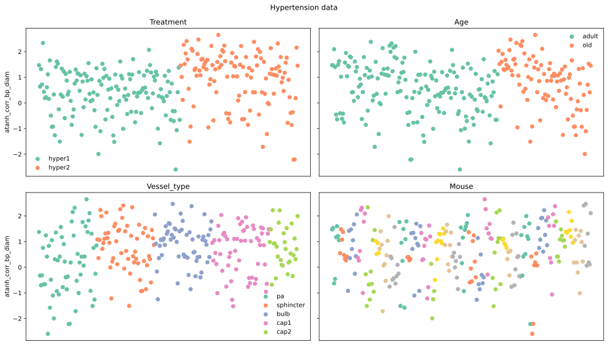
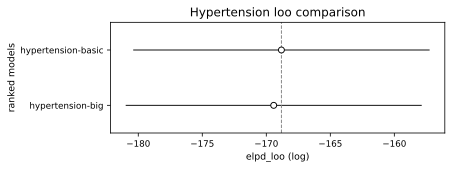
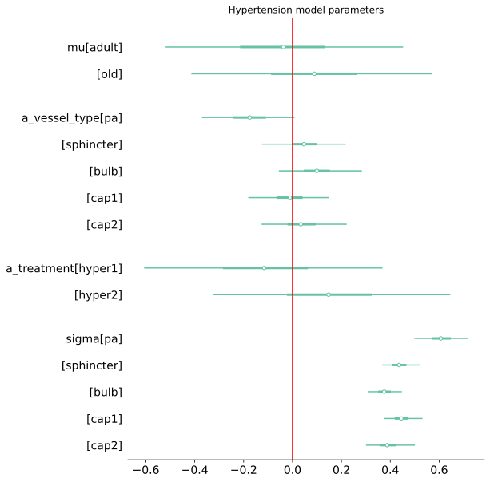
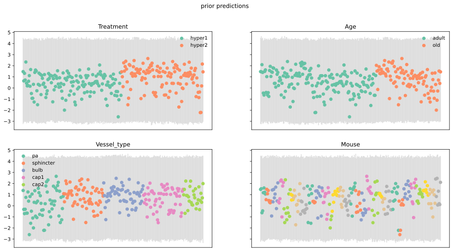

# Details of the hypertensive challenge analysis

## Dependent variable

The raw data on hypertension challenge were correlation coefficients relating
blood pressure and vessel diameter, which are constrained to lie on the $[-1,
1]$ interval. For easier modelling we transformed these by applying an inverse
hyperbolic tangent function for use in modelling. The dependent variables then
had support on the entire real number line.

The resulting dataset is shown in @fig-hypertension-data. The transformed
correlation coefficients do not appear extremely dispersed, indicating that
standard modelling techniques ought to be able to describe them.

::: {#fig-hypertension-data}

:::

## Statistical model

Our final statistical model had the following form.

\begin{align}
\ln(y_{vtm}) &\sim N(\hat{y}_{vtm}, \sigma_v) \label{eq-hypertension-model} \\
\hat{y}_{vtm} &= \mu_a \nonumber \\
  &+ \alpha^{treatment}_{t} \nonumber \\
  &+ \alpha^{vesseltype}_{v} \nonumber \\
\alpha^{treatment}_t &\sim N(0, 0.5) \nonumber \\
\alpha^{vesseltype}_v &\sim N(0, \tau^{vesseltype}) \nonumber \\
\sigma_v &\sim HN(0, 0.5) \nonumber \\
\mu &\sim N(0, 0.5) \nonumber \\
\tau^{vesseltype} &\sim HN(0, 0.5) \nonumber
\end{align}

This model is different from the others in that we did not partially pool the
treatment effects, since there were only two of these in this case. We also
allowed the measurement error parameters $\sigma$ to vary according to vessel
type, since this improved model fit and predictive performance.

As in the other analyses, for investigation of interaction effects we fit
another model that extended our final model with a vessel type:treatment
interaction effect as follows:

\begin{align}
\hat{y}_{vtm} &= \mu_a \nonumber \\
  &+ \alpha^{treatment}_{t} \nonumber \\
  &+ \alpha^{vesseltype}_{v} \nonumber \\
  &+ \alpha^{vesseltype:treatment}_{vt} \nonumber \\
\alpha^{vesseltype:treatment}_v &\sim N(0, \tau^{vesseltype:treatment}) \nonumber \\
\tau^{vesseltype:treatment} &\sim HN(0, 0.5) \nonumber
\end{align}

## Results

@fig-hypertension-loo shows that, as in the other cases, including interaction
effects did not improve estimated predictive performance. The expected
leave-one-observation-out predictive density is estimated to be higher for the
model `hypertension-basic`, which did not have any interaction effects, than
for the interaction model `hypertension-big`. Furthermore, the standard error
for the difference in these two quantities is much smaller than the difference
itself, indicating that the ranking is robust.

::: {#fig-hypertension-loo}

Comparison of out-of-sample predictive performance of our hypertension models,
as measured by estimated leave-one-out expected log predictive density. The
two models have similar estimated performance, but the `hypertension-big` model
is clearly worse.

:::

@fig-hypertension-parameters shows the marginal distributions for
the non-hierarchical parameters in our final model. As shown in
@fig-hypertension-effects, there are clear differences between the different
`mu` and `a_treatment` parameters, indicating that there are important age and
treatment effects. There is also a difference between parameters corresponding
to penetrating arterioles and the other vessel type parameters. This reflects
the fact that the penetrating arterioles had lower pressure vs diameter
correlation coefficients than other vessels, and that the penetrating arteriole
measurements were more dispersed.

::: {#fig-hypertension-parameters}

1%-99% posterior intervals for parameters in our final hypertension model.

:::

@fig-hypertension-prior-predictions and @fig-hypertension-posterior-predictions show graphical prior and posterior predictive
checks for our final hypertension model. The fit is fairly good, with no obvious
systematic pattern in the errors, though slightly more observations lie outside
the plotted intervals than might be expected.

::: {#fig-hypertension-prior-predictions}

:::

::: {#fig-hypertension-posterior-predictions}

:::
