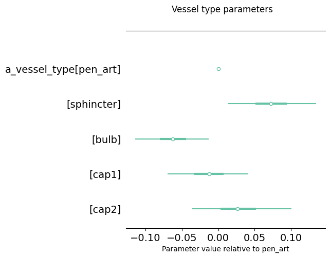
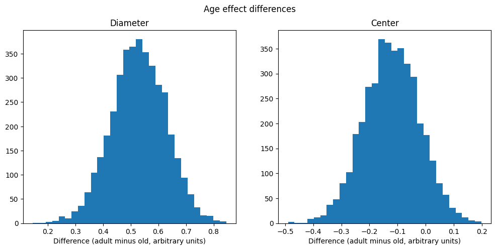
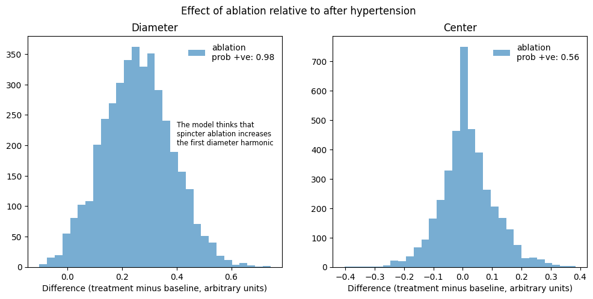

# Main findings

## Whisker stimulation

Our analysis of whisker stimulation data indicates that the hypertension
and sphincter ablation treatments are associated with lower whisker
stimulation response, as measured by log diameter change, compared with the
baseline treatment. The effect from whisker stimulation is greater than from
hypertension.

Figure @fig-whisker-treatment-effects illustrates this finding by showing the
distribution of posterior samples for treatment effects relative to baseline
from our best whisker stimulation model.

::: {#fig-whisker-treatment-effects layout-ncol=1}

Marginal posterior histograms for treatment effects, relative to the baseline
treatment. 

:::

Our analysis did not indicate any substantial difference between old and adult
mice, or any noticeable vessel type:treatment interaction effects. This can be
seen from figure @fig-whisker-small-effects, which shows posterior quantiles
for age and vessel type:treatment interaction effects in our model that included
both of these.

::: {#fig-whisker-small-effects layout-ncol=1}

Marginal 2.5%-97.5% posterior intervals for protocol effects

:::

We found some difference between vessel type effects: sphincters had the
greatest relative diameter change in response to whisker stimulation, and bulbs
the smallest. Figure @fig-whisker-vessel-type-effects shows these.

::: {#fig-whisker-vessel-type-effects layout-ncol=1}

Marginal 2.5%-97.5% posterior intervals for vessel type effects

:::

## Pulsatility

Our analysis of vessel centre and diameter pulsatility yielded the following
conclusions:

- Adult mice have higher vessel diameter pulsatility than old mice, whereas old
mice have slightly higher centre pulsatility.

- Sphincter ablation correlates with increased diameter pulsatility, with
no strong interaction effects. On the other hand there is no clear effect of
sphincter ablation on centre pulsatility.

@fig-pulsatility-age-effects plots the distribution of age effect differences
(adult minus old) for each measurement type in our final model. This graph shows
that, in this model, the age effect for adult mice was higher than for old mice
in every single posterior sample: in other words there is a clear trend for
older mice to have lower diameter pulsatility. There is a smaller opposite trend
for centre pulsatility measurements, but it is not clearly separated from zero,
indicating that the direction of the effect is not fully settled.

::: {#fig-pulsatility-age-effects}

Posterior distribution of age effect differences for each measurement type.

:::

@fig-pulsatility-treatment-effects shows the distribution of posterior draws for
sphincter ablation effects compared with the immediately prior protocol stage
("after hypertension"). The ablation/diameter parameter is greater than the
after hypertension/diameter parameter in 98% of posterior samples, whereas there
is no clear effect on centre pulsatility.

::: {#fig-pulsatility-treatment-effects}

Posterior distribution of treatment effect differences for each measurement type.

:::

## Red blood cell flow

Our main result regarding red blood cell speed is that this is higher in adult
mice compared with old mice.

## Hypertensive challenge
