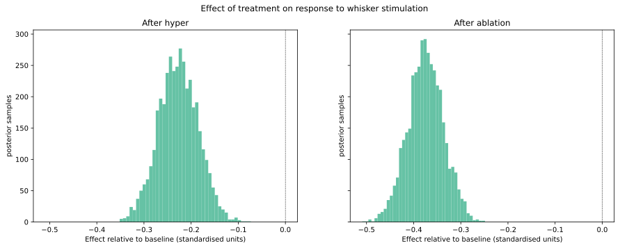
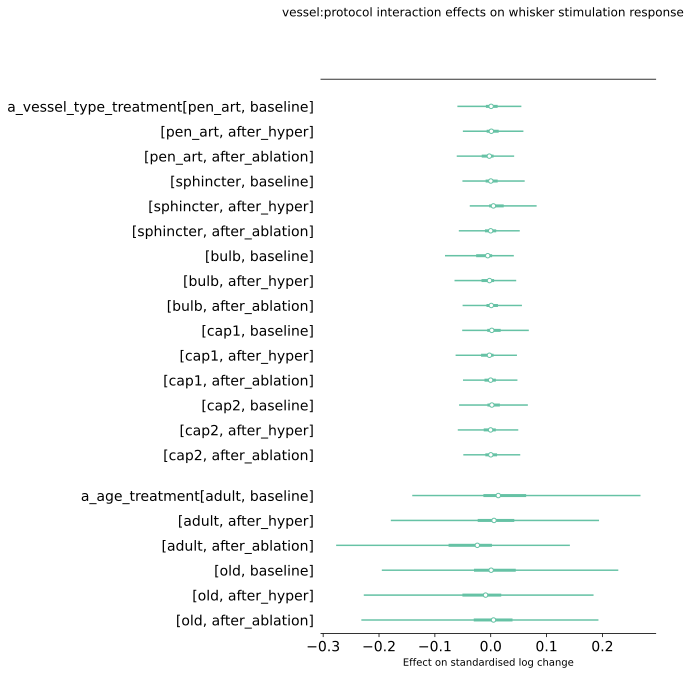
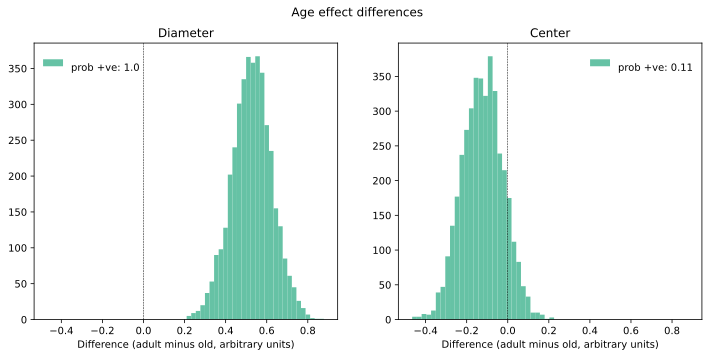
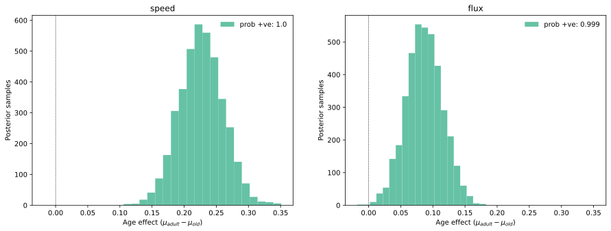
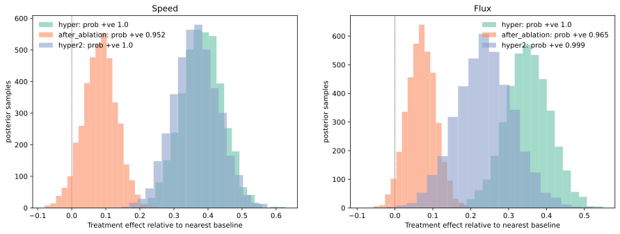
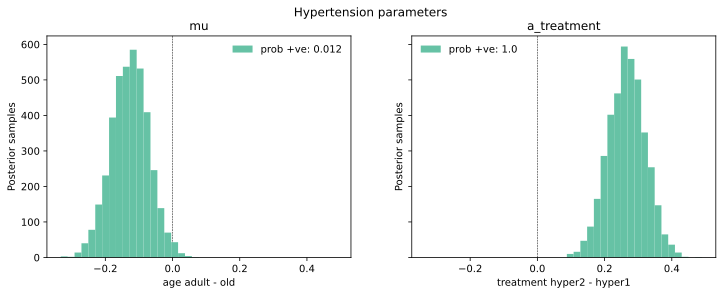
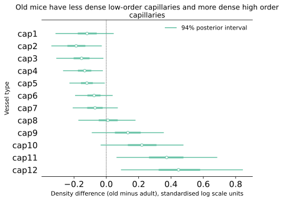
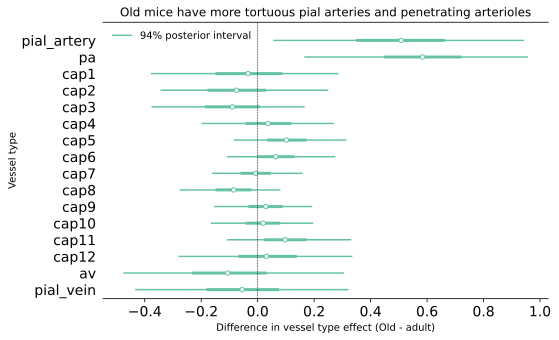

# Main findings

## Whisker stimulation

Our analysis of whisker stimulation data indicates that the hypertension
and sphincter ablation treatments are associated with lower whisker
stimulation response, as measured by log diameter change, compared with the
baseline treatment. The effect from whisker stimulation is greater than from
hypertension.

Figure @fig-whisker-treatment-effects illustrates this finding by showing the
distribution of posterior samples for treatment effects relative to baseline
from our best whisker stimulation model.

::: {#fig-whisker-treatment-effects layout-ncol=1}

Marginal posterior histograms for treatment effects, relative to the baseline
treatment. 

:::

Our analysis did not indicate any substantial difference between old and adult
mice, or any noticeable vessel type:treatment interaction effects. This can be
seen from figure @fig-whisker-small-effects, which shows posterior quantiles
for age and vessel type:treatment interaction effects in our model that included
both of these.

::: {#fig-whisker-small-effects layout-ncol=1}

Marginal 2.5%-97.5% posterior intervals for protocol effects

:::

We found some difference between vessel type effects: sphincters had the
greatest relative diameter change in response to whisker stimulation, and bulbs
the smallest. Figure @fig-whisker-vessel-type-effects shows these.

::: {#fig-whisker-vessel-type-effects layout-ncol=1}

Marginal 2.5%-97.5% posterior intervals for vessel type effects

:::

## Pulsatility

Our analysis of vessel centre and diameter pulsatility yielded the following
conclusions:

- Adult mice have higher vessel diameter pulsatility than old mice, whereas old
mice have slightly higher centre pulsatility.

- Sphincter ablation correlates with increased diameter pulsatility, with
no strong interaction effects. On the other hand there is no clear effect of
sphincter ablation on centre pulsatility.

@fig-pulsatility-age-effects plots the distribution of age effect differences
(adult minus old) for each measurement type in our final model. This graph
shows that, in this model, the age effect for adult mice was higher than for old
mice in every single posterior sample: in other words, according to our model
older mice have lower diameter pulsatility. There is a smaller opposite trend
for centre pulsatility measurements, but it is not clearly separated from zero,
indicating that the direction of the effect is not fully settled.

::: {#fig-pulsatility-age-effects}

Posterior distribution of age effect differences for each measurement type.

:::

@fig-pulsatility-treatment-effects shows the distribution of posterior draws for
sphincter ablation effects compared with the immediately prior protocol stage
("after hypertension"). The ablation/diameter parameter is greater than the
after hypertension/diameter parameter in 98% of posterior samples, whereas there
is no clear effect on centre pulsatility.

::: {#fig-pulsatility-treatment-effects}

Posterior distribution of treatment effect differences for each measurement type.

:::

## Red blood cell flow

Our main result regarding red blood cell flow is that both RBC speed and
flux were higher in the adult mice compared with the old mice. Figure
@fig-flow-age-effects illustrates this finding by plotting the relevant marginal
posterior histograms.

::: {#fig-flow-age-effects}

Posterior distributions of age effects on red blood cell speed and flux.

:::

We also quantified treatment effects on red blood cell flow, as shown in
@fig-flow-treatment-effects:

::: {#fig-flow-treatment-effects}

Posterior distributions of treatment effects on red blood cell speed and flux.
The nearest baseline for treatment `hyper` is `baseline`, and for treatments
`after_ablation` and `hyper2` it is `after_hyper`.

:::

## Hypertensive challenge

Our hypertensive challenge data also showed pronounced age and treatment
differences, as shown in figure @fig-hypertension-effects. Specifically, we
found that, for the adult mice, blood pressure and vessel diameter were less
correlated, and that the `hyper2` treatment was associated with increased
pressure-diameter correlation compared with the `hyper1` treatment.

::: {#fig-hypertension-effects}

Posterior distributions of relative age and treatment effects for hypertensive
challenge data.

:::

## Capillary density

The capillary density dataset had a somewhat different structure to the other
data, with no treatments, more vessel types, with clear correlation between
measurements corresponding to adjacent vessel types. We therefore used a
different statistical approach, with smoothing components for parameters of
adjacent vessel types. See @sec-density-model for more about this model.

Our analysis indicated that the old mice tended to have lower density
than the adult mice for capillaries of order 1 to 5 and higher density for
capillaries of order 10 to 12, and for ascending venules, as shown in figure
@fig-density-effects.

::: {#fig-density-effects}

Posterior distributions of differences in age-dependent parameters by vessel
type.

:::

## Vessel tortuosity

We also fit a smoothed regression model to measurements of vessel tortuosity
from the angio-architecture dataset. See @sec-tortuosity-model for details about
this model.

As shown in @fig-tortuosity-effects, our analysis showed a clear difference
between the adult and old mice in the upper vasculature, with the old mice
tending to have substantially more tortuous pial arteries and penetrating
arterioles. Other vessels were similarly tortuous for both age categories.

::: {#fig-tortuosity-effects}

Posterior distributions of differences in age-dependent tortuosity effects by
vessel type

:::

## Collaterals

We modelled the density of collateral vessels in adult and old mice, finding that old mice tended to have fewer collaterals, as shown in @fig-collaterals-effects.

::: {#fig-collaterals-effects}

Posterior distribution of differences in age effects on collateral density.

:::

Applying a similar analysis to measurements of collateral diameters, lengths and tortuosities, we found negligible age effects: see @fig-collaterals-non-effects

::: {#fig-collaterals-non-effects}

Posterior distribution of differences in age effects on collateral density.

:::

## Branchpoints

Our models of whether a branchpoint contained a bulb or sphincter indicated no particular age effect for sphincters, and a clear tendency for branchpoints in old mice to have more bulbs. These results are shown in @fig-branchpoint-effects.  

::: {#fig-branchpoint-effects}

Posterior distribution of differences in age effects on branchpoint sphincter and bulb probability.

:::

