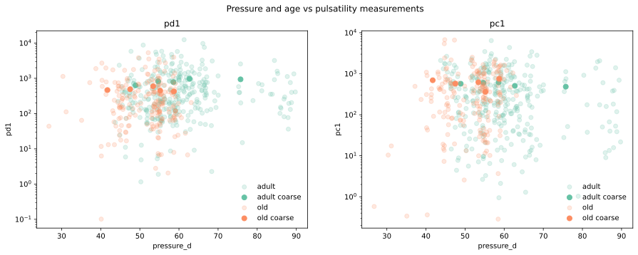
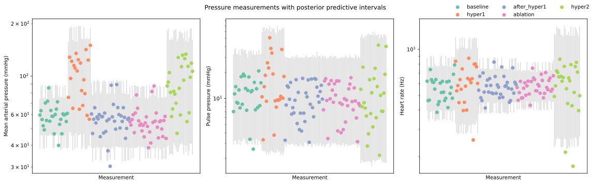

# Details of the pressure analysis {#sec-pressure-details}

<!-- Like the density analysis, the tortuosity analysis modelled the architecture dataset. -->

## Measurements

To model blood pressure we used a new dataset consisting of 140 measurements of 24 adult and 15 old mice. The mice underwent the following treatment regime:

1. baseline
2. hyper1
3. after_hyper1
4. ablation
5. hyper2

Each measurement records the mean arterial pressure (acronym MAP, units mmHg), pulse pressure (acronym PP, units mmHg) and heart rate (HR, units Hz) at a single point during this regime. The distrbution of measurements across ages and treatments was as follows:

| treatment    |   adult |   old |
|:-------------|--------:|------:|
| baseline     |      14 |    12 |
| hyper1       |      10 |    11 |
| after_hyper1 |      22 |    13 |
| ablation     |      21 |    13 |
| hyper2       |      13 |    11 |

These measurements are shown in @fig-pressure-measurements

::: {#fig-pressure-measurements}

:::

The most notable feature of these data is that that the data are clearly more dispersed for some treatments than for others. For example, for all three measurement types, the measurements for treatment "hyper1" are more dispersed than for treatments "baseline" and "after_hyper1".

## Statistical model

For modelling we log-transformed and standardised the measurements, then fit Bayesian linear models with fixed effects on the dependent variable for age, treatment and age-treatment interaction, as well as fitting treatment-specific measurement errors to capture the observed heteroskedasticity. 

We set informative priors for all of our model parameters based on our knowledge of the likely size of any effects.

In tilde notation, the model for a measurement $i$ of a mouse with with age $a$ at treatment stage $t$ was as follows:

$$
\begin{align}
\ln{y_{i}} &\sim N(\hat{y}_{at}, \sigma_{t}) \\
\hat{y}_{at} &= \alpha^{age}_a + \alpha^{treatment}_{t} + 
\alpha^{age:treatment}_{at} \\
\alpha^{age}_a &\sim N(0, 0.3) \\
\alpha^{treatment}_t &\sim N(0, 0.3) \\
\alpha^{age:treatment}_{at} &\sim N(0, 0.2) \\
\sigma_t &\sim HN(0, 0.5)
\end{align}
$$

## Results

@fig-pressure-ppc shows the measurements with our model's marginal posterior predictive distributions. The fit is overall adequate apart from a few outlier measurements under the hyper1 and hyper2 treatments. In particular, our model successfully captured the treatment-based heteroskedasticity in the data.

::: {#fig-pressure-ppc}

Grey bars represent our model's 1% to 99% posterior predictive interval for each measurement.

:::
