# Details of the pulsatility analysis

The pulsatility data consisted of fast measurements of diameter and center
point for the same mice. These measurements were Fourier-transformed, and
the harmonics of the transformed data were interpreted as representing the
pulsatility of the measured quantities.

## Dependent variable

We used the first harmonic of each transformed time series as a dependent
variable. It might have been preferable to aggregate all the available power
harmonics, but this would have complicated our measurement model, and in any
case power at the subsequent harmonics was typically negligible compared with
the first.

## Questions

As well as the results reported in the main findings section, we were also
interested in these additional questions:

::: {#thm-qc}
How does blood pressure affect diameter and centre pulsatility?
:::

::: {#thm-qd}
Do hypertension and sphincter ablation influence diameter and centre pulsatility
differently?
:::

## Description of the dataset

As well as the categorical data described above, our pulsatility analysis also
took into account measurements of each mouse's blood pressure at the femoral
artery.

The final dataset included 514 joint measurements of diameter and centre
pulsatility, calculated as described above. These measurements are shown in
@fig-pulsatility-dataset.

::: {#fig-pulsatility-dataset layout-nrow=2}
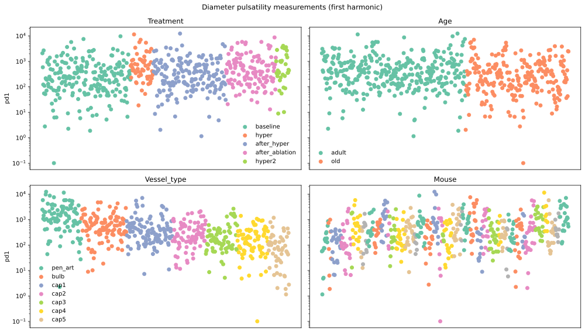

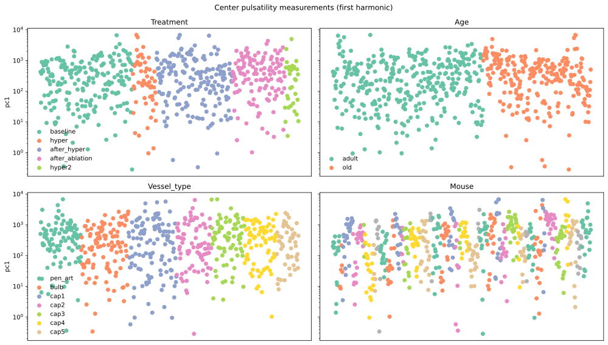

The modelled measurements, shown in order of the coloured categories. 
:::

@fig-pressure-data shows the relationship between pressure and the measurements
in our dataset for both age categories. The light dots show raw measurements and
the darker dots show averages within evenly sized bins.

::: {#fig-pressure-data}

Pulsatility measurements plotted against the corresponding pressure measurements
and coloured according to age. Darker dots indicate averages within evenly sized
pressure bins.

:::

@fig-diameter-data shows the relationship between diameter and the measurements
in our dataset for all vessel type categories. The light dots show raw
measurements and the darker dots show averages within evenly sized bins. There
is a clear positive relationship between measured absolute diameter and diameter
pulsatility, and it is approximately the same for all vessel types.

::: {#fig-diameter-data}
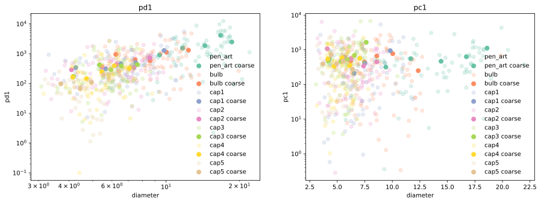

Pulsatility measurements plotted against the corresponding diameter measurements
and coloured according to vessel type. Darker dots indicate averages within
evenly sized pressure bins.

:::

## Statistical models

We knew from prior studies that the power harmonics should individually follow
exponential distributions [REFERENCE FOR THIS]. This consideration motivated the
use of exponential generalised linear models for both the centre and diameter
pulsatility measurements. In this model, given measurement $y$ and linear
predictor $\eta$ the measurement probability density is given by this equation:

\begin{align}
  p(y\mid\eta) &= Exponential(y, \lambda) \label{eq:pulsatility-measurement-model}  \\
  &= \lambda e^{-\lambda y}  \nonumber \\
  \ln{\frac{1}{\lambda}} &= \eta \label{eq:link-function}
\end{align}

The log link function \eqref{eq:link-function} was chosen so that linear
changes in the term $\eta$ induce multiplicative changes in the mean $\frac{1}
{\lambda}$ of the measurement distribution, as we believed the effects we wanted
to model would be multiplicative.

We compared four different ways of parameterising $\eta$ based on the
information available about a given measurement, corresponding to three
hypotheses about the way the data were generated. 

The simplest model, which we labelled "basic", calculates the linear predictor
$\eta^{basic}_{vtad}$ for an observation with vessel type $v$, treatment $t$,
age $a$ and diameter $d$ as follows:

\begin{align}
		\label{eq:basic}
    \eta^{basic}_{vtad} &= \mu_{a} \\
      &+ \alpha^{treatment}_{t} \nonumber \\
      &+ \alpha^{vesseltype}_{v} \nonumber \\
      &+ \beta^{diameter} \cdot \ln{d} \nonumber
\end{align}

The basic model provided a plausible baseline against which to compare the
other models.

Next we constructed a more complex model by extending the basic model with
interaction effects, resulting in the following linear predictor:

\begin{align}
		\label{eq:interaction}
    \eta^{interaction}_{vtad} &= \mu_{a} \\
      &+ \alpha^{treatment}_{t} \nonumber  \\
      &+ \alpha^{vesseltype}_{d,vesseltype(n)} \\
      &+ \alpha^{treatment:vesseltype}_{tv} \nonumber \\
    &+ \beta^{diameter}_{d} \cdot \ln{d} \nonumber
\end{align}

Next we constructed a model that adds to the basic model parameters that aim
to capture possible effects corresponding to the blood pressure measurements.
To compensate for collinearity between age and pressure, our "pressure" model
does not use the observed pressure as a predictor, but rather the age-normalised
pressure, calculated by subtracting the mean for each age category from
the observed pressure measurement. The model for the linear predictors   $
\eta^{pressure}_{vatdp}$ with age-normalised pressure measurement $p$ is then

\begin{align}
		\label{eq:pressure-model}
    \eta^{pressure}_{vatdp} &= \mu_{a} \\
      &+ \alpha^{treatment}_{t} \nonumber \\
      &+ \alpha^{vesseltype}_{v} \nonumber \\
      &+ \beta^{diameter}_{d} \cdot \ln{d} \nonumber \\
      &+ \beta^{pressure}_{a} \cdot p \nonumber
\end{align}

Finally, we made a model that includes a pressure effect but no age-specific
parameters from the pressure model. This was to test whether any age effects are
due to the collinearity between age and pressure. The pressure-no-age model's
linear predictors $\eta^{pressure\ no\ age}_{vatdp}$ are calculated as shown in equation \eqref{eq:pressure-no-age-model}. Note that,
unlike in equation \eqref{eq:pressure-model}, the $\mu$ and $\beta^{pressure}$
parameters in equation \eqref{eq:pressure-no-age-model} have no age indexes.

\begin{align}
		\label{eq:pressure-no-age-model}
    \eta^{pressure\ no\ age}_{vatdp} &= \mu \\
      &+ \alpha^{treatment}_{t} \nonumber \\
      &+ \alpha^{vesseltype}_{v} \nonumber  \\
      &+ \beta^{diameter}_{d} \cdot \ln{d} \nonumber \\
      &+ \beta^{pressure} \cdot p \nonumber
\end{align}

In all of our models the $\alpha$ parameters were given independent,
semi-informative, hierarchical prior distributions to allow for appropriate
information sharing. The $\beta$ and $\mu$ parameters were given independent,
semi-informative, non-hierarchical prior distributions.

## Results

We estimated the leave-one-out log predictive density for each model using
the method described in @vehtariPracticalBayesianModel2017 and implemented in
@kumarArviZUnifiedLibrary2019. The results of the comparison are shown below in
@fig-pulsatility-elpd-comparison.

::: {#fig-pulsatility-elpd-comparison}
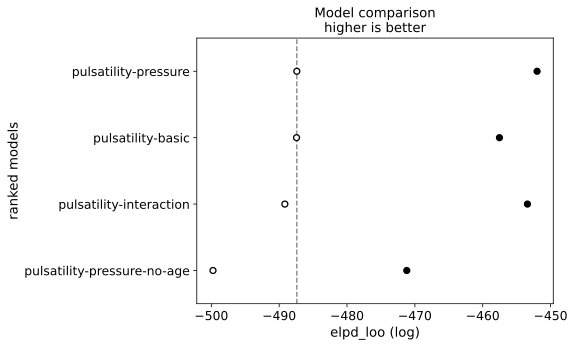

Comparison of estimated leave-one-out log predictive density (ELPD) for our
pulsatility models. The main result is that the pressure-no-age and interaction
models are clearly worse than the pressure model, as shown by the separation of
the relevant grey and dotted lines.

:::

We evaluated our models' fit to data using prior and posterior predictive
checking, with the results for the pressure model shown in @fig-pressure-ppc.

::: {#fig-pressure-ppc layout-nrow=4}

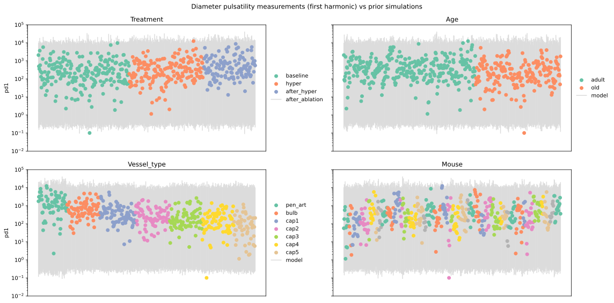

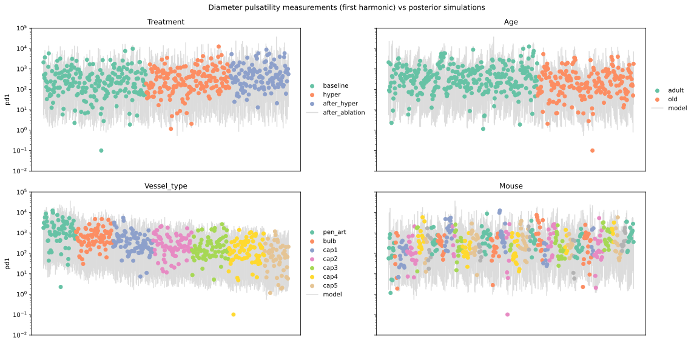

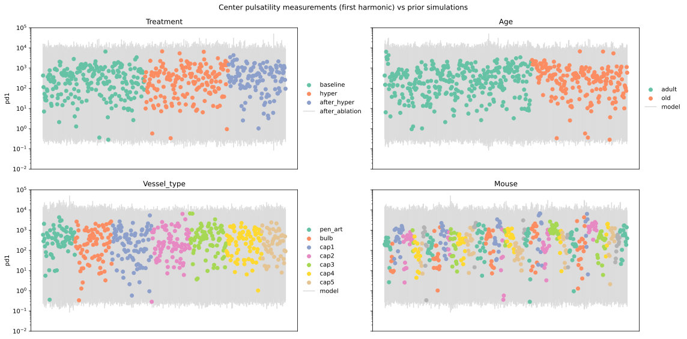

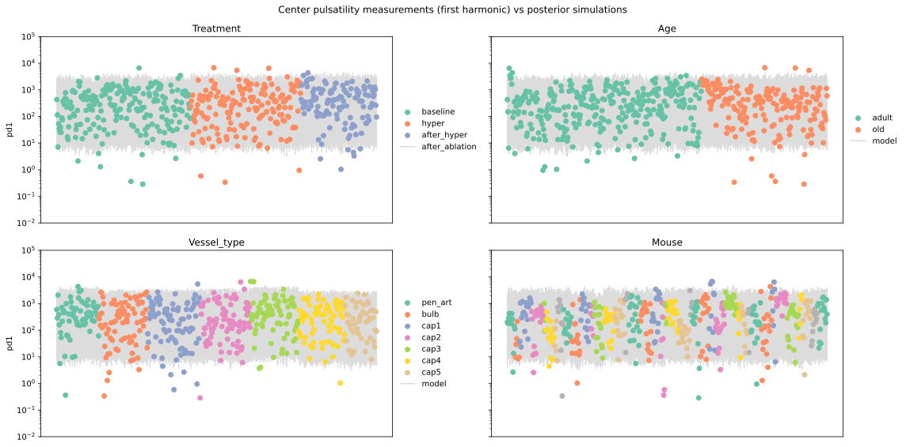

Prior and posterior predictive checks for the pressure model.
:::

Inspecting of the interaction model output showed that none of the interaction
effect parameters that differed substantially from zero, as can be seen in
@fig-pulsatility-interaction-effects.

::: {#fig-pulsatility-interaction-effects}
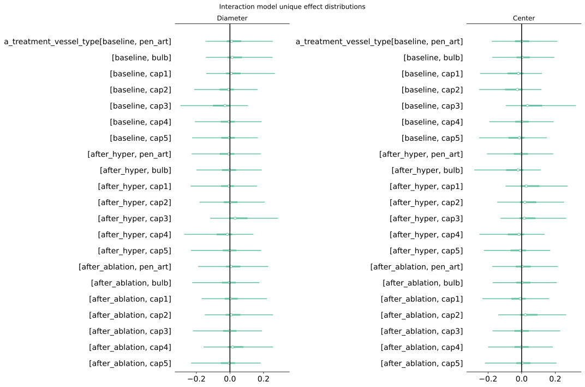

Marginal posterior quantiles for the unique effects in the interaction model.
:::

From this result, together with the worse estimated out of sample predictive
performance as shown in @fig-pulsatility-elpd-comparison, we concluded that there were
no important interaction effects, so that we could essentially discard the
interaction model.

@fig-pulsatility-effects shows the marginal posterior distributions for other effect
parameters in all three models. Note that the parameters `b_diameter` are
strongly positive for diameter pulsatility in all models and also mostly
positive for centre pulsatility. There is also a strong trend for diameter
pulsatility to decrease with the order of the vessel and no particular vessel
type trend for centre pulsatility.

::: {#fig-pulsatility-effects}

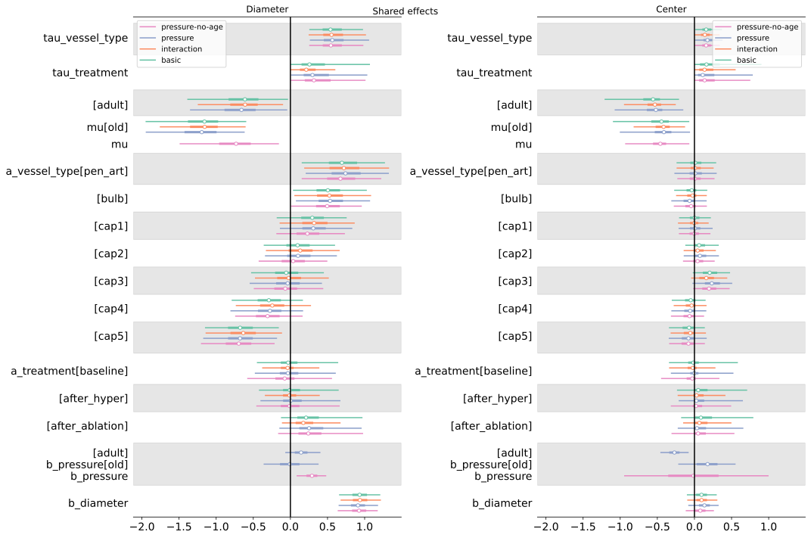

Marginal posterior quantiles for shared model effects.
:::

## Answers to specific questions

The poorer estimated out of sample predictive performance of the
pressure-no-age model compared with the other models, as shown in
@fig-pulsatility-elpd-comparison, indicates that our pressure measurements did
not fully explain the observed difference between adult and old mice. It is
nonetheless possible that different pressure explains the difference between
old and adult mice, but that the pressure measurements did not reflect the
true pressure at the measured vessels. This is plausible since the pressure
measurements were taken at a different location.

@fig-pulsatility-pressure-effects shows the difference in $\beta^{pressure}$ parameters
for old and adult mice in the pressure model in order to answer @thm-qc. This
shows a weak tendency of the pressure effect on diameter pulsatility to be
more positive for adult mice than for old mice, and a strong opposite tendency
for centre pulsatility. Taking the absolute values into account, the analysis
suggests that greater measured pressure is not strongly related to diameter
pulsatility and correlates with reduced centre pulsatility for adult mice but
not for old mice.

::: {#fig-pulsatility-pressure-effects}
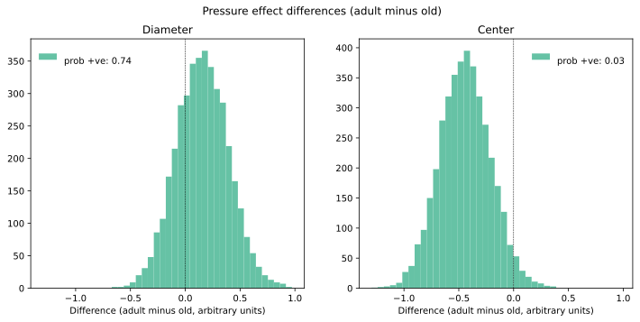

Posterior distribution of pressure effect differences for each measurement type.

:::

To illustrate the effect of treatments, and specifically sphincter ablation
relative to hypertension (i.e. to answer @thm-qd) @fig-pulsatility-treatment-effects shows the difference
between the effect for each treatment and the baseline treatment effect. There
is a clear effect of ablation to increase diameter pulsatility and no clear
effects of hypertension on diameter pulsatility or of either treatment on centre
pulsatility.

::: {#fig-pulsatility-treatment-effects}

Posterior distribution of treatment effect differences for each measurement type.

:::

To get an idea about how the effect of sphincter ablation on diameter
pulsatility compares quantitatively with the effect of hypertension, we fit
the basic model to the full dataset, without excluding measurements from either
hypertension treatment. @fig-pulsatility-treatment-effects-full shows the main result
from fitting this model: ablation and hypertension had similarly positive
effects on diameter pulsatility. Interestingly there is no clear effect from the
second hypertension treatment.

::: {#fig-pulsatility-treatment-effects-full}
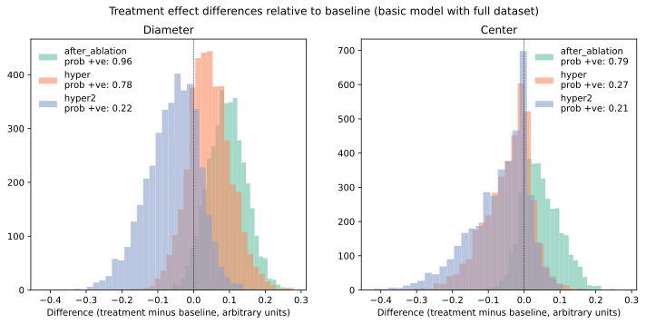

Treatment effect distributions relative to baseline in the basic model when fit
to the full dataset including all treatments.

:::

::: {.content-hidden}

## Notes and Comments

- [] Next: part 3, autoregulation, what is going on during the hypertension?

Idea is that blood pressure increases, and we can measure vessel diameters. If
the brain works, it can protect itself from the higher pressure by constricting
vessels. If the autoregulation is broken, then the diameter will increase
with the pressure. Measure correlation between time series of blood pressure
measurements and diameter increase. Also another parameter: how long did
the pressure stay elevated? Trying to find whether the brain has failed or not.

- [] Part 4: shape of the blood vessels. Are vessels longer in old vs adult? A
bit different, not too crazy.

- [] How to include in the analysis red blood cell speed and flux? Can this be
added to the pulsatility model? We measure this locally, which is nice. This is
the closest thing we can get to measuring the local pressure because pressure
difference determines the speed. If velocity is same for old and adult that
indicates that the pressure is similar. There is a censoring issue: if the speed
is too high, the data is likely missing.

:::
