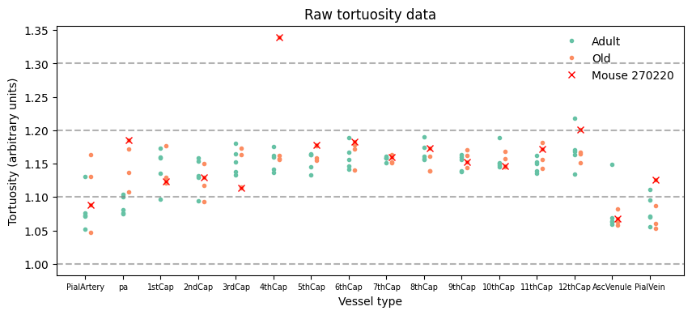
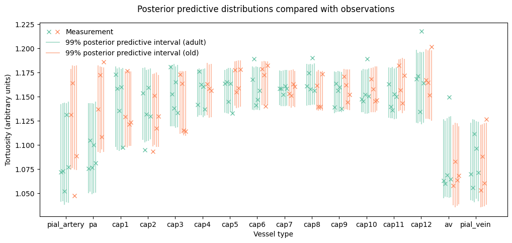
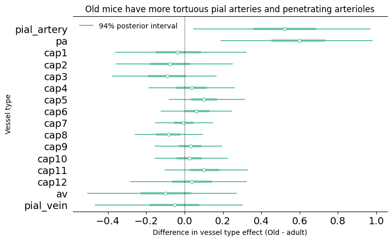

# Details of the tortuosity analysis {#sec-tortuosity-details}

Like the density analysis, the tortuosity analysis modelled the architecture
dataset.

## Dependent variable

The dependent variable in this case was vessel tortuosity, measured as
total vessel length divided by straight-line length. 

The raw measurements are shown in @fig-tortuosity-measurements.

:::{#fig-tortuosity-measurements}

Vessel tortuosity measurements

:::

There is a clear outlier for mouse 270220 at the 4th capillary: we excluded this
measurement but kept other measurements from this mouse as they did not seem
particularly anomalous.

Otherwise, we observed a similar pattern of smoothness between adjacent vessel
as with the density measurements, motivating the use of a model with smoothed
latent parameters. Unlike with the density measurements, however, there is some
variety in the size of the jumps from vessel type to vessel type. In particular,
the adult mice show a sharp upward jump from vessel pa to the first capillary,
and both the adult and old mice show a downward jump in tortuosity at the
ascending venule.

## Statistical model {#sec-tortuosity-model}

As with the density dataset, we used a regression model with random-walk priors
to smooth adjacent vessel type effects within age categories and measurement
errors for adjacent vessel types. In order to appropriately capture the
heterogeneity in jump sizes, we used a student-t distribution rather than a
normal distribution for the random walk in vessel type effects, with the degrees
of freedom parameter modelled hierarchically.

The model specification is as follows, with $\ln{y}^{std}$ representing the
log-transformed and then standardised tortuosity measurements:

\begin{align}
p(y\mid\alpha, \sigma) &= Normal(\ln{y}^{std}\mid \alpha, \sigma) \label{eq:measurement-model-tortuosity} \\
\alpha_{a,v} &\sim ST(\nu, \alpha_{a,v-1}, \lambda^{\alpha}_a) \nonumber \\
\ln\sigma^{std}_{v} &\sim N(\ln\sigma^{std}_{v-1}, \lambda^s) \nonumber \\
\nu &\sim \Gamma(2, 0.1) \nonumber \\
\alpha_{,0} &\sim N(0, 1) \nonumber \\
\ln\sigma^{std}_{0} &\sim N(-1.5, 0.8) \nonumber \\ 
\lambda &\sim N(0, 0.2) \nonumber \\
\lambda^{s} &\sim N(0, 0.2) \nonumber 
\end{align}

## Results

@fig-tortuosity-ppc shows this model's posterior predictive distribution
alongside the retained measurements, indicating a reasonably good fit.

:::{#fig-tortuosity-ppc}

Marginal posterior predictive distributions alongside tortuosity measurements

:::

The posterior predictive distributions for upper vessels "pial artery" and "pa"
appear different for old and adult mice. To ascertain the extent and certainty
of this contrast we plotted the differences between vessel type effects for old
and adult mice in @fig-tortuosity-effects-detail. From this plot it is clear
that, according to our model, there is a pronounced and robust difference, with
over 97% probability of each effect being greater for old mice.

:::{#fig-tortuosity-effects-detail}

Main result of our tortuosity analysis: the vessel type effect for tortuosity is greater for old mice than for adult mice.

:::
