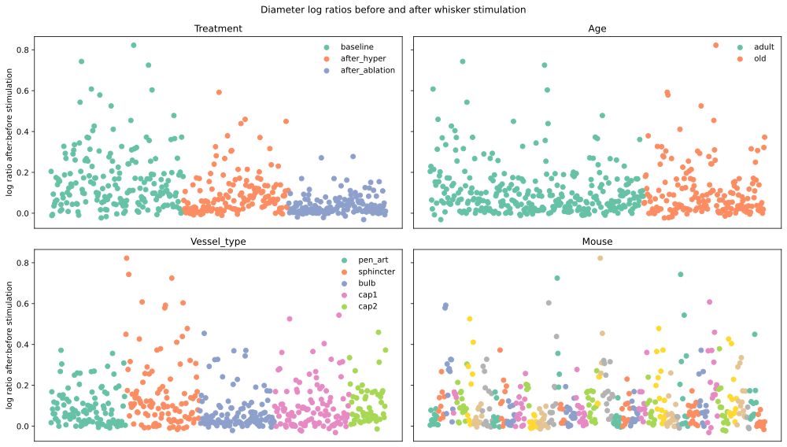
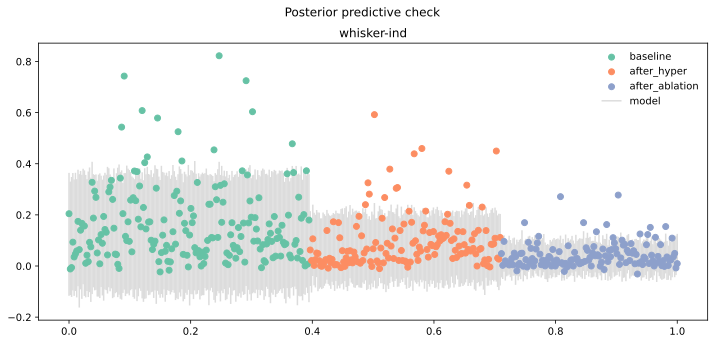
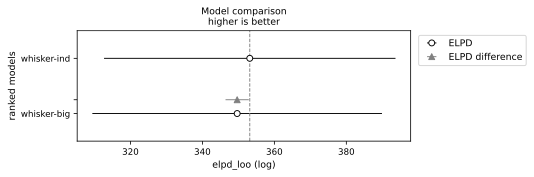

# Details of the whisker stimulation analysis

In order to measure how vascular responsiveness changed during our experimental
protocol, the diameters of different vessel types were recorded before and
during whisker stimulation, at baseline, post-hypertension and post-ablation
stages. We aimed to assess statistical relationships between the known factors
and the relative change in vessel diameter before and after stimulation.

In particular, we were interested in differences between old and adult mice
and in the effect of sphincter ablation.

## Dependent variable

The ratio of the peak compared with the pre-stimulation level for each mouse
at each stage, on natural logarithmic scale, also known as the 'log change',
was standardised by subtracting the overall mean and dividing by the standard
deviation, then treated as a single measurement. This way of the measurements
was chosen to facilitate modelling, as log change is a symmetric and additive
measure of relative change (see @tornqvistHowShouldRelative1985).

Note that when the difference between the two values $v1$ and $v2$ is far less
than 1, the log change $\ln{\frac{v2}{v1}}$ is approximately the same as the
more widely used relative difference measure $\frac{v2-v1}{v1}$.

## Statistical Models

The final model is shown below:

\begin{align}
y_{vtm} &\sim ST(\nu, \hat{y}_{vtm}, \sigma_{t}) \label{eq-whisker-model} \\
\hat{y}_{vtm} &= \mu_a \nonumber \\
  &+ \alpha^{treatment}_{t} \nonumber \\
  &+ \alpha^{vesseltype}_v \nonumber \\
\alpha^{treatment}_t &\sim N(0, \tau^{treatment}) \nonumber \\
\alpha^{vesseltype}_v &\sim N(0, \tau^{vesseltype}) \nonumber \\
\nu &\sim Gamma(2, 0.1) \nonumber \\
\sigma_t &\sim HN(0, 0.5) \nonumber \\
\mu &\sim N(0, 0.7) \nonumber \\
\tau^{treatment} &\sim HN(0, 0.7) \nonumber \\
\tau^{vesseltype} &\sim HN(0, 0.7) \nonumber
\end{align}

In equation \eqref{eq-whisker-model}, the term $ST$ indicates the student
t distribution, $N$ indicates the normal distribution, $Gamma$ the gamma
distribution and $HN$ the 'half-normal' distribution, i.e. the normal
distribution with support only for non-negative numbers. Subscripts indicate
indexes and superscripts indicate parameter labels.

This model has independent effects for treatments ($\alpha^{treatment}$), vessel
types ($\alpha^{vessel}$) and age ($\mu$). The treatment and vessel type effects
have hierarchical priors, reflecting the need to partially pool information
between different treatment and vessel type categories. This structure allows
our model to accommodate the full spectrum between different categories being
highly heterogenous---in this case the corresponding $\tau$ parameter will
be large---and on the other hand high similarity, leading to small $\tau$
parameters. The student t distribution was chosen to reflect the heavy tails
we observed in the data, with the parameter $\nu$ controlling the level of
heaviness.

The prior standard deviation 0.7 was chosen because it led to what we judged
to be a reasonable allocation of prior probability mass over possible data
realisations. The prior for the student t degrees of freedom parameter $\nu$ was
set following the recommendation in @juarezModelBasedClusteringNonGaussian2010.

As well as this model, we also present results from a more complex model that
adds vessel type:treatment and age:treatment interaction effects. The full
specification of this "big" model is as follows, using the same notation as
equation \eqref{eq-whisker-model}:

\begin{align}
y_{vtm} &\sim ST(\nu, \hat{y}_{vtm}, \sigma_{t}) \label{eq-whisker-model-interaction} \\
\hat{y}_{vtm} &= \mu_a \nonumber \\
  &+ \alpha^{treatment}_{t} \nonumber \\
  &+ \alpha^{vesseltype}_v \nonumber \\
  &+ \alpha^{vesseltype:treatment}_{vt} \nonumber \\
  &+ \alpha^{age:treatment}_{vt} \nonumber \\
\alpha^{treatment}_t &\sim N(0, \tau^{treatment}) \nonumber \\
\alpha^{vessel}_v &\sim N(0, \tau^{vessel}) \nonumber \\
\alpha^{vesseltype:treatment}_{vt} &\sim N(0, \tau^{vesseltype:treatment}) \nonumber \\
\alpha^{age:treatment}_{at} &\sim N(0, \tau^{age:treatment}) \nonumber \\
\nu &\sim Gamma(2, 0.1) \nonumber \\
\sigma &\sim HN(0, 0.5) \nonumber \\
\mu &\sim N(0, 0.7) \nonumber \\
\tau^{treatment} &\sim HN(0, 0.7) \nonumber \\
\tau^{vessel} &\sim HN(0, 0.7) \nonumber \\
\tau^{age:treatment} &\sim HN(0, 0.7) \nonumber \\
\tau^{vesseltype:treatment} &\sim HN(0, 0.7) \nonumber 
\end{align}

## Results

@fig-whisker-measurements shows the observed log change measurements with
colours illustrating the various categorical information. Note that the
measurements have different dispersion depending on the treatment, indicating a
the need for a model with distributional effects.

::: {#fig-whisker-measurements layout-ncol=1}

Raw measurements

:::

@fig-whisker-posterior-check compares the measurements with our model's
posterior predictive distribution. This shows that our model achieved a
reasonable fit to the observed data. There is a pattern in the model's bad
predictions, in that these tend to be for higher baseline measurements. However,
we judged that this pattern was small enough that for our purposes we could
disregard it.

::: {#fig-whisker-posterior-check layout-ncol=1}

Graphical posterior predictive check
:::

To back up our finding that there were no important interaction effects, we
compared the predictive performance of our final model `whisker-ind` with
`whisker-big`, the best-performing model with more interactions. The results are
shown below in figure @fig-whisker-loo-compare:

::: {#fig-whisker-loo-compare layout-ncol=1}

Comparison of estimated leave-one-oout log predictive density between the final
model `whisker-ind` and the best performing interaction model `whisker-big`.

:::

The two models have similar estimated predictive performance, indicating that
there is no gain from considering interaction effects in this case.
