In order to measure how the vascular responsiveness changed during our
experimental protocol, the diameters of different vessel types was recorded
before and during whisker stimulation, at baseline, post-hypertension and
post-ablation stages. The ratio of the peak compared with the pre-stimulation
level for each mouse at each stage, on natural logarithmic scale, also known as
the 'log change', was standardised by subtracting the overall mean and dividing
by the standard deviation, then treated as a single measurement.

This way of the measurements was chosen to facilitate modelling, as
log change is a symmetric and additive measure of relative change (see
@tornqvistHowShouldRelative1985). Note that when the difference between the two
values $v1$ and $v2$ is far less than 1, the log change $\ln{\frac{v2}{v1}}$is
approximately the same as the classical relative difference $\frac{v2-v1}{v1}$.

# Questions

We were interested in two specific questions pertaining to whisker stimulation:

1a) Is there a difference between old and adult mice in the diameter log change
for different vessels?

1b) Does sphincter ablation affect diameter log change to a different extent for
adult and old mice?

To answer these questions, we fit a Bayesian multilevel regression model.

## Missing data

[DESCRIBE MISSING DATA]

We assume that all missing measurements were caused by factors that were
unrelated to our main target process (equivalently that the absent measurements
were "missing at random"). We therefore did not attempt to model the measurement
removal process explicitly.

## Implementation

We implemented our model in Stan [@carpenterStanProbabilisticProgramming2017]
and interfaced with data via the Python library cmdstanpy
[@standevelopmentteamCmdStanPy2022].  Posterior analysis was facilitated by the
library arviz [@kumarArviZUnifiedLibrary2019]. The analysis was orchestrated
using the template package bibat [@bibat].

All the code implementing the analysis, as well as instructions for
reproduction, can be found at <https://github/teddygroves/sphincter>.

## Statistical Model

The final model is shown below:

\begin{align}
y_{vtm} &\sim ST(\nu, \hat{y}_{vtm}, \sigma) \label{eq-whisker-model} \\
\hat{y}_{vtm} &= \mu 
  + \alpha^{treatment}_{t}
  + \alpha^{vessel}_v 
  + \alpha^{protocol}_{vt} 
  + \beta^{age}_{vt} \cdot old(m) 
  + \alpha^{mouse}_{vtm}  \nonumber \\
\alpha^{treatment}_t &\sim N(0, \tau^{treatment}) \nonumber \\
\alpha^{vessel}_v &\sim N(0, \tau^{vessel}) \nonumber \\
\alpha^{protocol}_{vt} &\sim N(0, \tau^{protocol}) \nonumber \\
\alpha^{mouse}_{vtm} &\sim N(0, \tau^{mouse}_{t}) \nonumber \\
\beta^{age}_{vt} &\sim N(0, \tau^{age}) \nonumber \\
\nu &\sim Gamma(2, 0.1) \nonumber \\
\sigma &\sim HN(0, 0.5) \nonumber \\
\mu &\sim N(0, 0.7) \nonumber \\
\tau^{treatment} &\sim HN(0, 0.7) \nonumber \\
\tau^{vessel} &\sim HN(0, 0.7) \nonumber \\
\tau^{protocol} &\sim HN(0, 0.7) \nonumber 
\end{align}

In equation \eqref{eq-whisker-model}, the term $ST$ indicates the student t
distribution, $old$ is an indicator function with value $old(m)=1$ if mouse
$m$ is old, and zero otherwise, $N$ indicates the normal distribution, $Gamma$
the gamma distribution and $HN$ the 'half-normal' distribution, i.e. the normal
distribution with support only for non-negative numbers.

This model was the end result of fitting a series of Bayesian multilevel models,
following the strategy outlined in @gelmanBayesianWorkflow2020. The prior
standard deviation 0.7 was chosen because it led to what we judged to be a
reasonable allocation of prior probability mass over possible data realisations.
The prior for the student t degrees of freedom parameter $\nu$ was set following
the recommendation in @juarezModelBasedClusteringNonGaussian2010.

This model is flexible enough to allow age effects that vary depending on
treatment and vessel type, but also allows these parameters to be shrunk
towards zero if the data suggests that there is little difference between
these categories. Our questions can be answered by inspecting the parameters
$\beta^{age}$. If, for a particular vessel type, our model allocates low
probability mass to small values of this parameter, this indicates a difference
between old and adult mice with respect to this vessel type. In particular, if
the values for the sphincter vessel type tend to be far from zero, that would
show an age difference for this vessel type.

## Results

@fig-whisker-measurements shows the observed log change measurements with
colours illustrating the various categorical information. Note that there is
more variation in the baseline log change values than in the values after either
treatment.

::: {#fig-whisker-measurements layout-ncol=1}

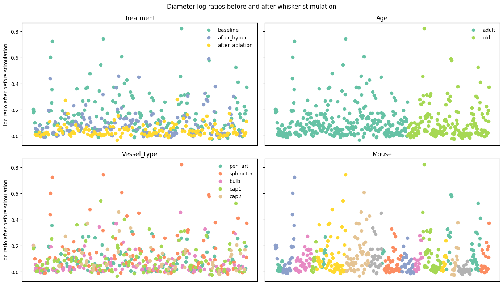

Raw measurements

:::

@fig-whisker-posterior-check compares the measurements with our model's
posterior predictive distribution. This shows that our model achieved a
reasonable fit to the observed data. There is a pattern in the model's bad
predictions, in that these tend to be for higher baseline measurements. However,
we judged that this pattern was small enough that for our purposes we could
disregard it.

::: {#fig-whisker-posterior-check layout-ncol=1}

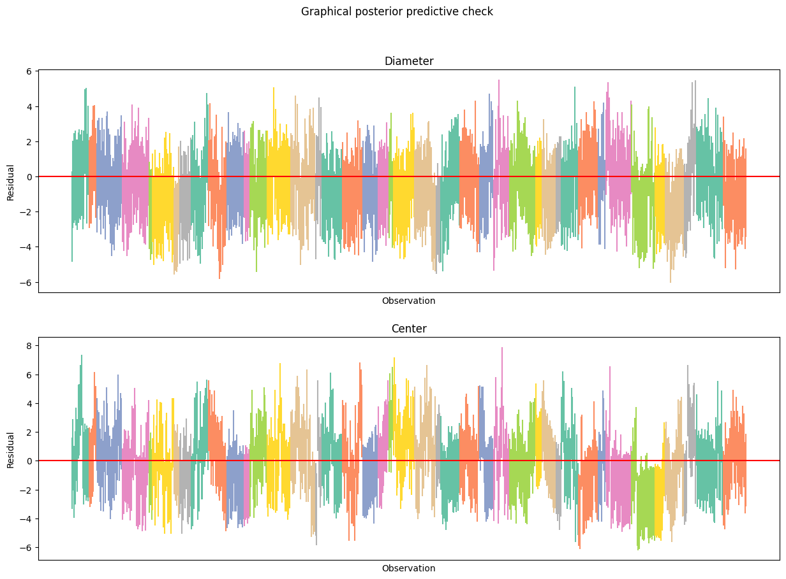

Graphical posterior predictive check
:::

@fig-whisker-age-effects answers our questions 1a) and 1b): we found no
significant age effects for any vessel or treatment.

::: {#fig-whisker-age-effects layout-ncol=1}

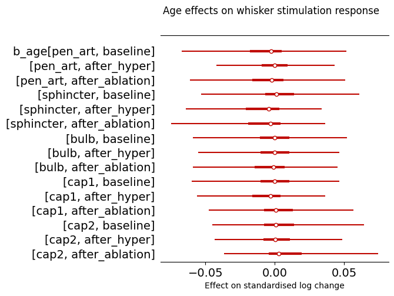

Marginal 2.5%-97.5% posterior intervals for age effects
:::

This does not mean that there were no significant treatment effects,
but just that these effects did not depend on age or vessel type.
@fig-whisker-treatment-effects shows the marginal posterior distributions for
hypertension and ablation effects relative to the baseline, showing a clear
effect in both cases.

::: {#fig-whisker-treatment-effects layout-ncol=1}

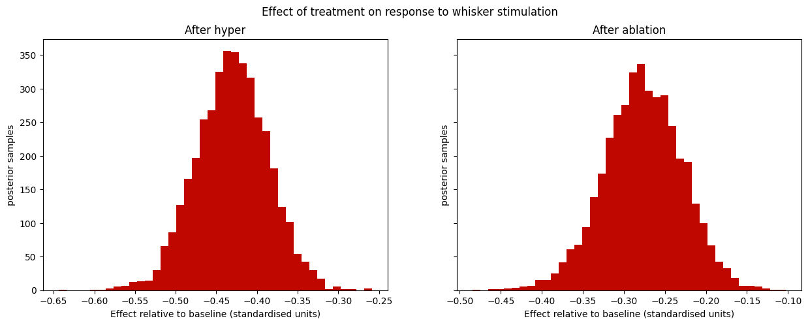

Marginal posterior intervals for treatment effects, relative to the baseline
treatment.

:::

These effects were the same for all vessel types, as can be seen from
@fig-whisker-protocol-effects, which shows that these were largely irrelevant.

::: {#fig-whisker-protocol-effects layout-ncol=1}

Marginal 2.5%-97.5% posterior intervals for protocol effects

:::

There was also a significant distributional effect of treatment. This is
captured by @fig-whisker-tau-mouse, which shows marginal posterior distributions
for the parameters $\tau^{mouse}$. It was higher for the baseline treatment
than for either of the interventions, reflecting the pattern noted above in the
raw data.

::: {#fig-whisker-tau-mouse layout-ncol=1}

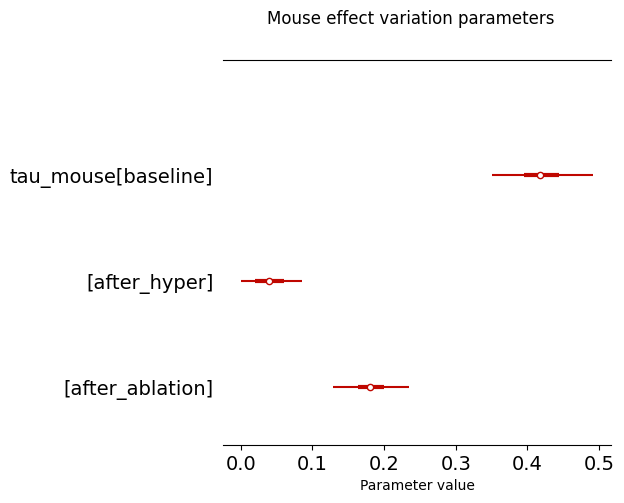

Marginal 2.5%-97.5% posterior intervals for $\tau^{mouse}$ parameters.

:::

# Pulsatility data

The pulsatility data consisted of fast measurements of diameter and center
point for the same mice. These measurements were Fourier-transformed, and
the harmonics of the transformed data were interpreted as representing the
pulsatility of the measured quantities.

We aimed to answer the following questions:

a) Do diameter or center pulsatility depend on age? If so, is this dependency
mediated by the higher average blood pressure of adult mice compared with old
mice?

b) Does sphincter ablation affect diameter and/or center pulsatility differently
in adult and old mice?

c) How does blood pressure affect diameter and center pulsatility?

d) Do hypertension and sphincter ablation influence diameters, Pd, and Pc
differently for different vessels?

To answer these questions we created a pulsatility dataset and fit a series of
statistical models to it.

## Description of the dataset

We used the first harmonic of each transformed time series as a dependent
variable. It might have been preferable to aggregate all the available power
harmonics, but this would have complicated our measurement model, and in any
case power at the subsequent harmonics was typically negligible compared with
the first.

For each measurement the following information was available:

- the identity of the mouse, and that mouse's age (adult or old)
- the vessel type (penetrating artery, bulb and first three capillary orders)
- the treatment (baseline, after hypertension and after ablation)
- the mouse's blood pressure, measured at the femoral artery

The final dataset included 514 joint measurements of diameter and center
pulsatility, calculated as described above. These measurements are shown in
@fig-pulsatility-dataset.

::: {#fig-pulsatility-dataset layout-nrow=2}
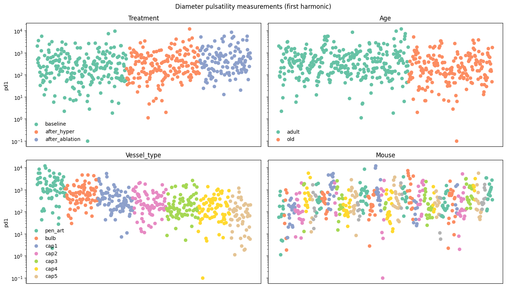

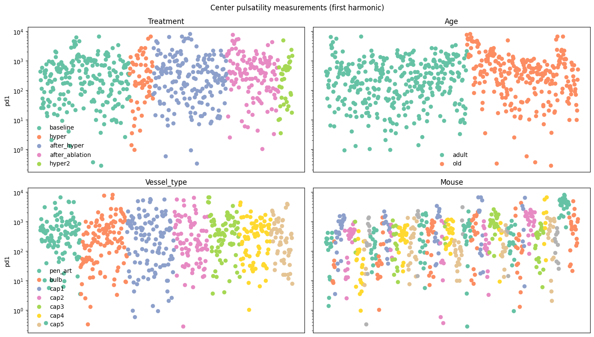

The modelled measurements, shown in order of the coloured categories. 
:::

@fig-pressure-data shows the relationship between pressure and the measurements
in our dataset for both age categories. The light dots show raw measurements and
the darker dots show averages within evenly sized bins.

::: {#fig-pressure-data}
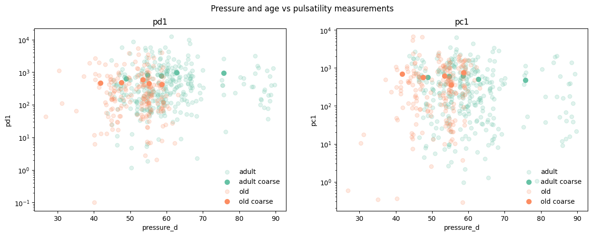

Pulsatility measurements plotted against the corresponding pressure measurements
and coloured according to age. Darker dots indicate averages within evenly sized
pressure bins.

:::

## Missing data

Data from one mouse (index 310321) were excluded after some extreme measurements
were observed:

::: {callout-note}
310321 is a mouse where we did not see any whisker response, it reacted to
angiotensin II, but the BP increase was abrupted for a short while and then
reestablished. Perhaps due to a clot or a bubble in the venous catheter. This
resulted in a biphasic and slow BP increase
:::

As with the whisker stimulation data we assumed that all absent measurements
were missing at random.

## Statistical model

We knew from prior studies that the power harmonics should individually follow
exponential distributions [REFERENCE FOR THIS]. This consideration motivated the
use of exponential generalised linear models for both the center and diameter
pulsatility measurements. In this model, given measurement $y$ and linear
predictor $\eta$ the measurmeent probability density is given by

\begin{align}
  p(y\mid\eta) &= Exponential(y, \lambda) = \lambda e^{-\lambda y} \label{eq:q2-measurement-model} \\
  \ln{\frac{1}{\lambda}} &= \eta \label{eq:link-function}
\end{align}

The log link function \eqref{eq:link-function} was chosen so that linear
changes in the term $\eta$ induce multiplicative changes in the mean $\frac{1}
{\lambda}$ of the measurement distribution, as we believed the effects we wanted
to model would be multiplicative.

We compared four different ways of parameterising $\eta$ based on the
information available about a given measurement, corresponding to three
hypotheses about the way the data were generated. 

The simplest, or "basic", model postulates that the linear predictors 
$\eta^{basic}_{d}$ and  $\eta^{basic}_{c}$ are the sums of independent 
parameters corresponding to non-interacting features as follows:

\begin{align}
		\label{eq:basic}
    \eta^{basic}_{d,n} = \mu_{d, age(mouse(n))} 
      + \alpha^{treatment}_{d,treatment(n)}
      + \alpha^{vessel\ type}_{d,vessel\ type(n)} \\
    \eta^{basic}_{c,n} = \mu_{c, age(mouse(n))} 
      + \alpha^{treatment}_{c,treatment(n)}
      + \alpha^{vessel\ type}_{c,vessel\ type(n)} \nonumber
\end{align}

The basic model was chosen as a plausible baseline against which to compare the
other models.

The "interaction" model was chosen to explore whether there were any
important interaction effects that the basic model does not consider. For
example, question b) can be interpreted as asking whether there is are any
significant effects corresponding to the interaction between age and treatment.
Our interaction model calculates the value of the linear predictors  
$\eta^{interaction}_{d}$ and $\eta^{interaction}_{c}$ as depending on
age-treatment and age-treatment-vessel type interaction effects as follows:

\begin{align}
		\label{eq:interaction}
    \eta^{interaction}_{d,n} = \mu_{d, age(mouse(n))} 
      + \alpha^{treatment}_{d,treatment(n)}
      + \alpha^{vessel\ type}_{d,vessel\ type(n)} \\
    &+ \alpha^{age:treatment}_{d, age(mouse(n)), treatment(n)} \nonumber \\
    &+ \alpha^{age:treatment:vessel\ type}_{d, age(mouse(n)), treatment(n), vessel\ type(n)} \nonumber \\
    \eta^{interaction}_{c,n} &= \mu_{c, age(mouse(n))} 
      + \alpha^{treatment}_{c,treatment(n)} \nonumber
      + \alpha^{vessel\ type}_{c,vessel\ type(n)} \\
    &+ \alpha^{age:treatment}_{c, age(mouse(n)), treatment(n)} \nonumber \\
    &+ \alpha^{age:treatment:vessel\ type}_{c, age(mouse(n)), treatment(n), vessel\ type(n)} \nonumber
\end{align}

Next, we constructed a model that adds to the basic model parameters
that aim to capture possible effects corresponding to the blood pressure
measurements. To compensate for collinearity between age and pressure, our
"pressure" model does not use the observed pressure as a predictor, but rather
the age-normalised pressure, calculated by subtracting the mean for each age
category from the observed pressure measurement. The model for the linear predictors  
$\eta^{pressure}_{d}$ and $\eta^{pressure}_{c}$ is then as follows:

\begin{align}
		\label{eq:pressure-model}
    \eta^{pressure}_{d,n} &= \mu_{d, age(mouse(n))} 
      + \alpha^{treatment}_{d,treatment(n)}
      + \alpha^{vessel\ type}_{d,vessel\ type(n)} \\
    &+ \beta^{pressure}_{d, age(mouse(n))} \cdot norm\ pressure_{n} \nonumber \\
    \eta^{pressure}_{c,n} &= \mu_{c, age(mouse(n))} 
      + \alpha^{treatment}_{c,treatment(n)} \nonumber
      + \alpha^{vessel\ type}_{c,vessel\ type(n)} \\
    &+ \beta^{pressure}_{c, age(mouse(n))} \cdot norm\ pressure_{n} \nonumber
\end{align}

Finally, we made a model that includes a pressure effect but no age-specific
parameters from the pressure model. This is to test whether any age effects are
due to the collinearity between age and pressure. The pressure-no-age model's
linear predictors $\eta^{pressure-no-age}_{d}$ and $\eta^{pressure-no-age}_{c}$
are calculated as shown in equation \eqref{eq:pressure-no-age-model}. Note that,
unlike in equation \eqref{eq:pressure-model}, the $\mu$ and $\beta^{pressure}$
parameters in equation \eqref{eq:pressure-no-age-model} have no age indexes.

\begin{align}
		\label{eq:pressure-no-age-model}
    \eta^{pressure-no-age}_{d,n} &= \mu_{d} 
      + \alpha^{treatment}_{d,treatment(n)}
      + \alpha^{vessel\ type}_{d,vessel\ type(n)} \\
    &+ \beta^{pressure}_{d} \cdot norm\ pressure_{n} \nonumber \\
    \eta^{pressure}_{c,n} &= \mu_{c} 
      + \alpha^{treatment}_{c,treatment(n)} \nonumber
      + \alpha^{vessel\ type}_{c,vessel\ type(n)} \\
    &+ \beta^{pressure}_{c} \cdot norm\ pressure_{n} \nonumber
\end{align}

In all of our models the $\alpha$ parameters were given independent,
semi-informative, hierarchical prior distributions to allow for appropriate
information sharing. The $\beta^{pressure}$ parameters were given
independent, semi-informative, non-hierarchical prior distributions.

## Results

We estimated the leave-one-out log predictive density for each model using
the method described in @vehtariPracticalBayesianModel2017 and implemented in
@kumarArviZUnifiedLibrary2019. The results of the comparison are shown below in
@fig-q2-elpd-comparison.

::: {#fig-q2-elpd-comparison}
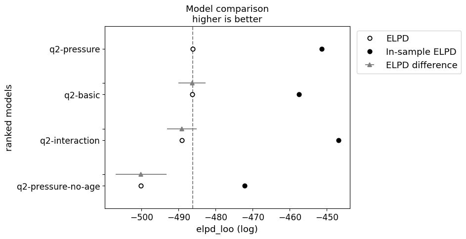

Comparison of estimated leave-one-out log predictive density (ELPD) for our
pulsatility models. The main result is that the pressure-no-age and interaction
models are clearly worse than the pressure model, as shown by the separation of
the relevant grey and dotted lines.

:::

We evaluated our models' fit to data using prior and posterior predictive
checking, with the results for the pressure model shown in @fig-pressure-ppc.

::: {#fig-pressure-ppc layout-nrow=4}

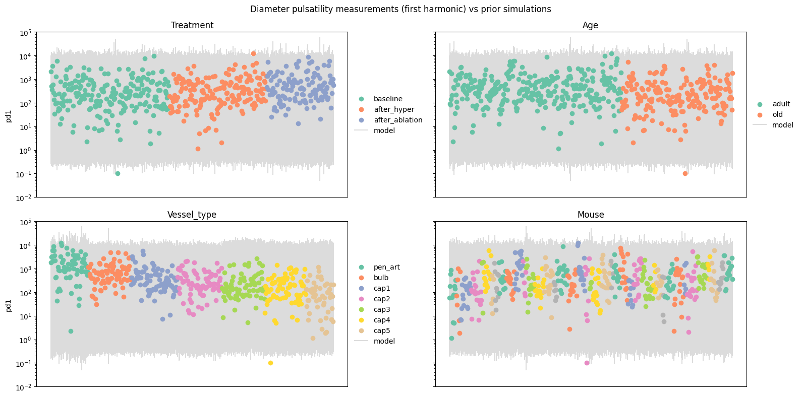
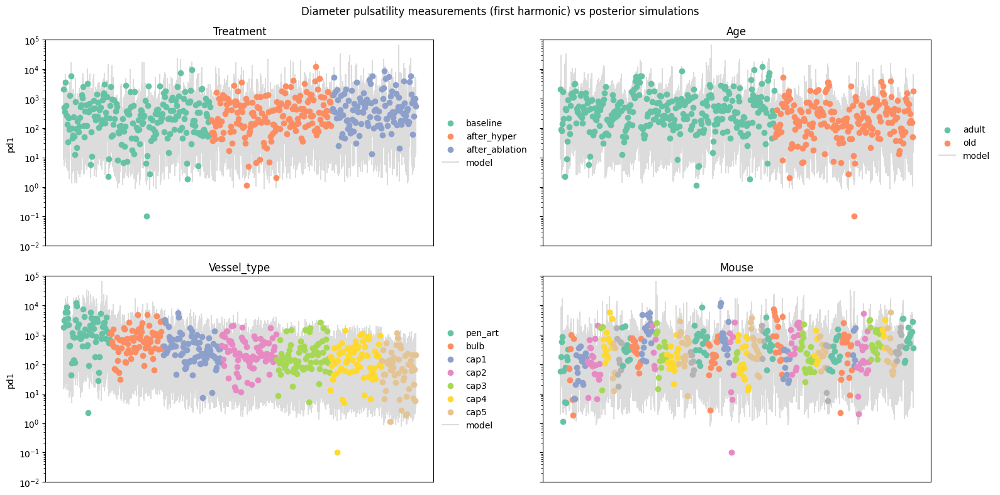
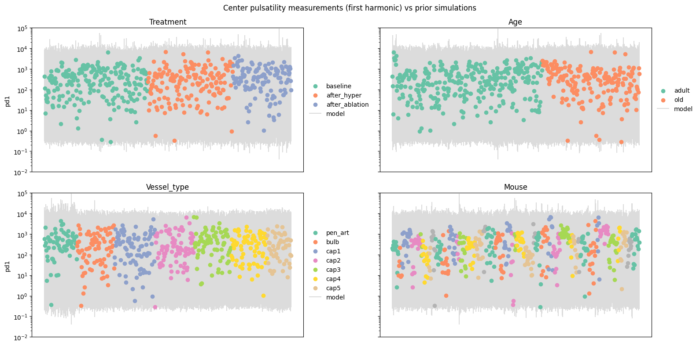
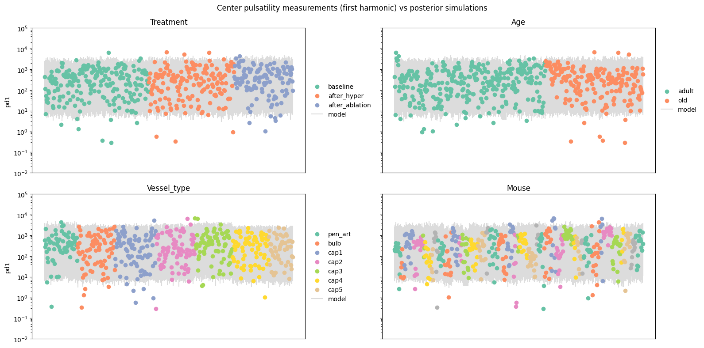

Prior and posterior predictive checks for the pressure model.
:::

Inspecting of the interaction model output showed that none of the interaction
effect parameters that differed substantially from zero, as can be seen in
@fig-q2-interaction-effects.

::: {#fig-q2-interaction-effects}
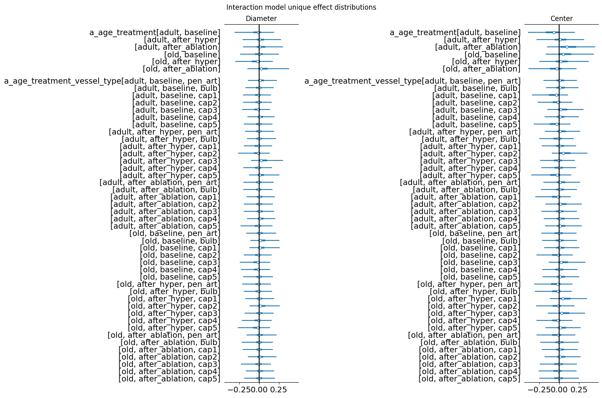

Marginal posterior quantiles for the unique effects in the interaction model.
:::

From this result, together with the worse estimated out of sample predictive
performance as shown in @fig-q2-elpd-comparison, we concluded that there were
no important interaction effects, so that we could essentially discard the
interaction model.

@fig-q2-effects shows the marginal posterior distributions for other effect
parameters in all three models.

::: {#fig-q2-effects}

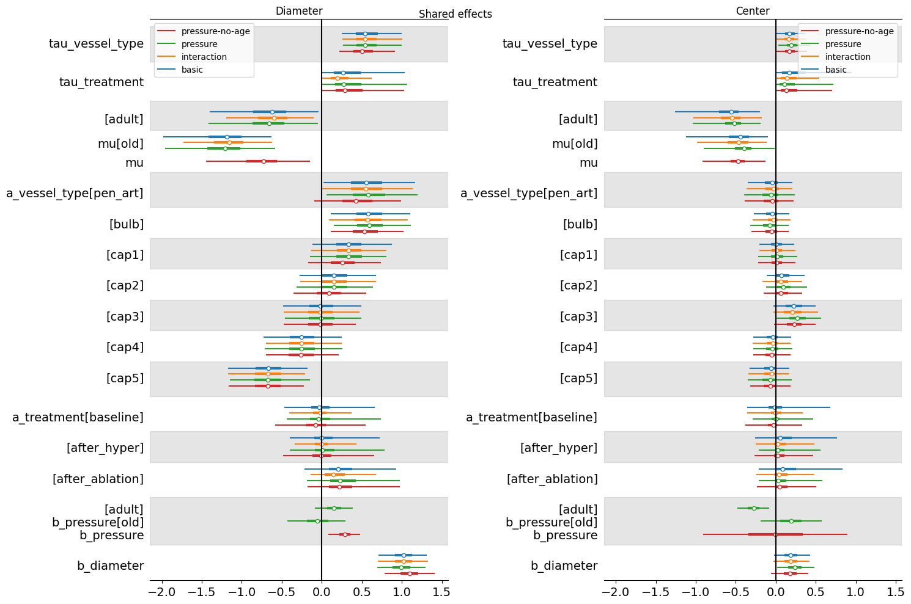

Marginal posterior quantiles for shared model effects.
:::

### Answers to specific questions

To address whether there are important age effects, @fig-q2-age-effects plots
the distribution of age effect differences (adult - old) for each measurement
type in the pressure model.

This graph shows that, in this model, the mean parameter for diameter
pulsatility in adult mice was higher than for old mice in every single posterior
sample - in other words there is a clear trend for older mice to have lower
diameter pulsatility. There is a smaller opposite trend for center pulsatility
measurements, but it is not clearly separated from zero, indicating that the
direction of the effect is not fully settled.

::: {#fig-q2-age-effects}
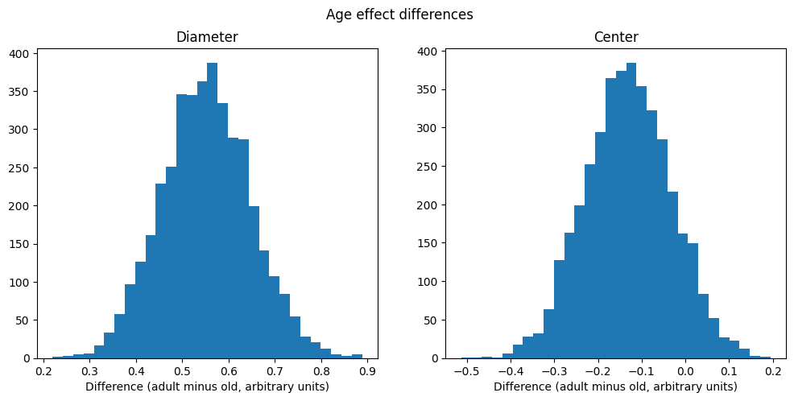

Posterior distribution of age effect differences for each measurement type.

:::

The next question concerns whether the age effects are explained by the
generally higher blood pressure of the adult mice. This question mostly
answered by the poorer estimated out of sample predictive performance
of the pressure-no-age model compared with the other models as shown in
@fig-q2-elpd-comparison. This shows that there is information in the age
labels beyond what is contained in the pressure measurements. It is nonetheless
possible that different pressure explains the difference between old and adult
mice, but that the pressure measurements did not reflect the true pressure at
the measured vessels. This is plausible since the pressure measurements were
taken at a different location.

@fig-q2-pressure-effects shows the difference in $\beta^{pressure}$ parameters
for old and adult mice in the pressure model. This shows noticeable but not
fully resolved effects for both measurement types. Specifically, the model
thinks that the pressure effect on diameter pulsatility is somewhat more
positive for adult mice, while the pressure effect on center pulsatility is
somewhat more negative for adult mice. The most interesting thing to take away
from this graph is that there is not a clear resolution away from zero in either
case. This shows that the effect of normalised pressure is not very pronounced.

Overall, this analysis suggests that higher pressure tends to somewhat increase
diameter pulsatility and somewhat decrease center pulsatility, though the
results are not definitive. This is partly due to the collinearity between age
and pressure that makes the effects of the two difficult to distinguish, and
perhaps also due to the limitations of the pressure measurements.

::: {#fig-q2-pressure-effects}
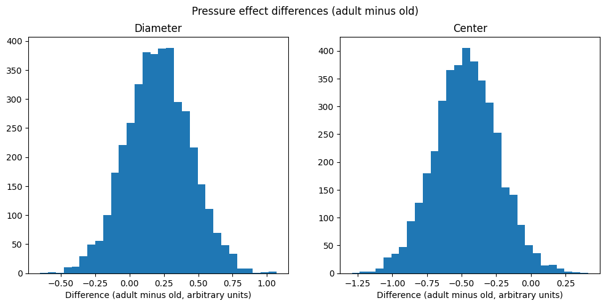

Posterior distribution of pressure effect differences for each measurement type.

:::

To illustrate the effect of treatments, and specifically sphincter ablation
relative to hypertension, @fig-q2-treatment-effects shows the difference between
the effect for each treatment and the baseline treatment effect. There is a
clear effect of ablation to increase diameter pulsatility, a smaller tendency of
hypertension to do the same, and no clear effects of either treatment on center
pulsatility.

::: {#fig-q2-treatment-effects}
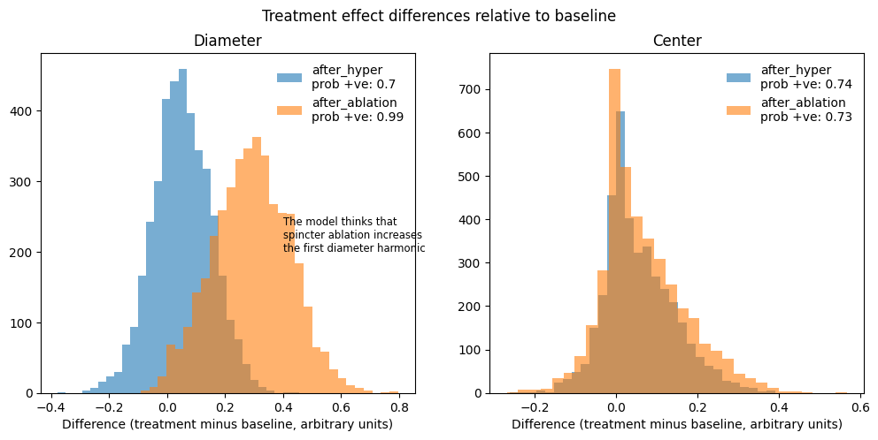

Posterior distribution of treatment effect differences for each measurement type.

:::

::: {.content-hidden}

## Notes and Comments

- [] Statistical testing in general: in normal case we would do multiple
hypothesis testing correction. Explain why it is OK to have a separate model for
each question (because we assume the modelled processes are independent)

- [] Add an explanatory section at the start.

- [] Change parameter names to be more explicit about interaction terms

- [] Check that all interaction effect combinations have been included.

- [] Next week update for Martin and Søren: explain what are the main results
with graphs. 

The sum of two different power
harmonics with exponential rate parameters $\lambda_1$ and $\lambda_2$ should
follow the hypoexponential distribution with the probability density function
shown in equation \eqref{}

\begin{equation}
f(x, \lambda_1, \lambda_2) = \frac{\lambda_1\cdot\lambda_2}{\lambda_1-lambda_2}(\exp^{-x\lambda_2}-\exp^{-x\lambda_1})
\end{equation}

:::
